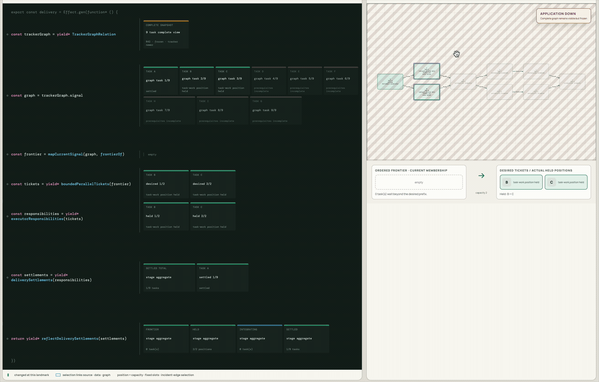

# Dalph

Dalph is a graph-native delivery orchestrator. It consumes a tracker-owned task
DAG, derives the runnable frontier, and supervises bounded concurrent task
workflows while preserving exact worktree, review, retry, integration,
recovery, evidence, and cleanup semantics.

The task tracker remains authoritative for work identity and dependencies. Git
remains authoritative for source lineage and accepted integration. Dalph owns
only its managed execution history and typed orchestration decisions.

## Dalph in motion

The delivery workflow and its live orchestration state, side by side:



## Status

Production implementation is split across the packages described below. The current
vertical slice reads a controlled tracker fixture, validates and projects its
task DAG, derives a bounded runnable frontier, and executes that frontier
through a read-only dry-run interpreter. Dry-run completion timing is
reproducible, while the semantic trace preserves the order in which concurrent
outcomes are observed.

The current CLI is deliberately fixture-only and requires `--dry`. The
production package now contains the complete GitHub graph reader and an atomic
label-backed task-claim adapter, while CLI registration of those live adapters
remains separate work. The CLI does not yet create worktrees, run real task
work, integrate accepted results, or establish a terminal run disposition.

## Repository map

- `docs/` — stable Dalph context and architecture.
- `packages/contracts/` — exact contracts shared by orchestration and executor implementations.
- `packages/orchestrator/` — generic Effect V4 workflow coordination and authority adapters.
- `packages/dalph/` — the CLI, application composition, and concrete presentation.
- `research/` — completed Wayfinder decisions and market/tool evaluations.
- `prototypes/control-plane/` — disposable Effect V4 seam evidence.
- `prototypes/execution-trace/` — disposable multi-actor trace presentation.

The prototypes are evidence, not production architecture or compatibility
targets.

## Try the current implementation

Dalph supports Node 24 from 24.20.0. Other Node majors are not supported.
Use Node 24.20.0 with pnpm 10.29.0 or newer.

```sh
pnpm install
pnpm build
node packages/dalph/dist/bin/dalph.js \
  run packages/orchestrator/fixtures/diamond.json --dry
```

The command emits newline-delimited semantic trace items. With the diamond
fixture you can witness one tracker-graph observation, bounded admission of the
currently eligible tasks, and simulated task outcomes. The larger retained
fixture is available at
`packages/orchestrator/fixtures/wayfinder-105.json`.

For a visual preview of the intended experience, run the disposable historical
execution-trace prototype:

```sh
pnpm install --dir prototypes/execution-trace --ignore-workspace
pnpm --dir prototypes/execution-trace dev
```

Open `http://localhost:5173`. The workbench provides synchronized task and
causal graphs, cursor replay, actor spans, dependency focus, pan/zoom/fit, a
minimap, convergence collapsing, and both focused and large-run fixtures. Its
execution occurrences are simulated decision evidence. This isolated app has
its own fixtures and projection code; it neither imports nor executes
`packages/orchestrator`.

## Development

Use pnpm. Work is performed on `master`; implementation tickets declare their
blocking edges and acceptance evidence in GitHub.

Install dependencies with `pnpm install`, use focused package tests while
developing, and run `pnpm check:all` before handoff. The root harness enforces
strict TypeScript and Effect-aware linting, dependency-cycle and duplication
checks, enforced test coverage, and secret scanning. See
[`docs/DEVELOPMENT.md`](docs/DEVELOPMENT.md) and
[`docs/CODE_REVIEW.md`](docs/CODE_REVIEW.md).
