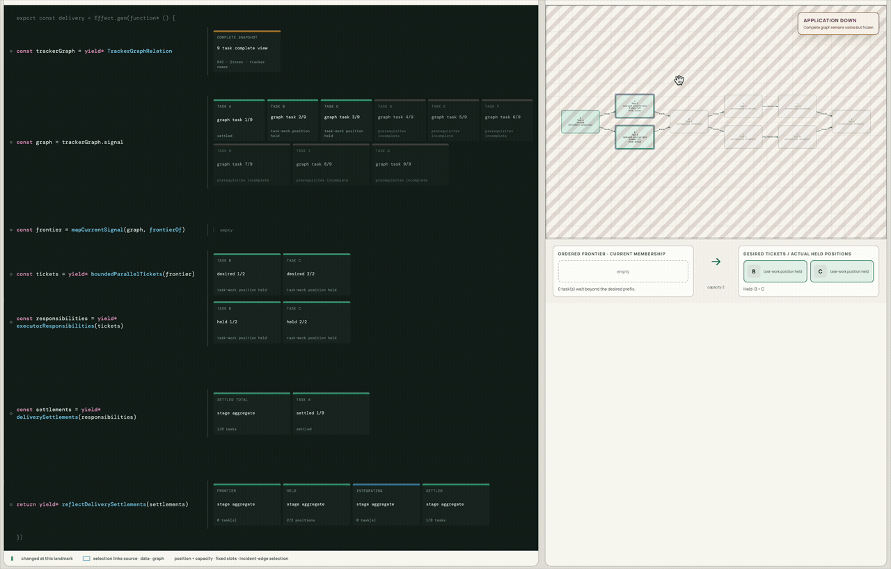

# Dalph

Dalph is a graph-native delivery orchestrator. It consumes a tracker-owned task
DAG, derives the runnable frontier, and supervises bounded concurrent task
workflows while preserving exact worktree, review, retry, integration,
recovery, evidence, and cleanup semantics.

The task tracker remains authoritative for work identity and dependencies. Git
remains authoritative for source lineage and accepted integration. Dalph owns
only its managed execution history and typed orchestration decisions.

## Dalph in motion

The delivery workflow and its live orchestration state, side by side:



## Status

Production implementation is split across the packages described below. The
CLI requires Alice to choose `--dry` or `--production` explicitly. Dry-run
retains the controlled/read-only interpreter. Production accepts one GitHub
issue target and a decoded repository-host configuration, then reports the
exact allocated or recovered Run and immutable historical snapshots. Passive
current-status attachment, bounded SIGINT/SIGTERM Exit, and same-Run recovery
after process loss are also available.

Attached CLI snapshots, MCP and watch updates keep failed attempts visible with
safe failure categories, retained candidate/worktree facts and observed task
identity. `lastSubstantiveAt` identifies the accepted observation of actual
progress; repeated lifecycle reports do not advance it. Tracker waits distinguish
provider throttling from a local circuit and retain retry timing only when the
provider supplied it. Unknown facts and unsupported recovery are explicit.
Task delivery and Run completion remain separate from application finalization:
a provider-close failure can leave a completed Run while the process exits
nonzero with a sanitized stderr diagnosis. See the
[diagnostic scenarios](docs/scenarios/actionable-failure-diagnostics.md).

## Repository map

- `docs/` — stable Dalph context and architecture.
- `packages/contracts/` — exact contracts shared by orchestration and executor implementations.
- `packages/orchestrator/` — generic Effect V4 workflow coordination and authority adapters.
- `packages/dalph/` — the CLI, application composition, and concrete presentation.
- `prototypes/reducer-lab/` — maintained evaluation and visualization of production cassettes.

Current requirements live in the architecture, ADRs, scenarios, and executable
contracts. Completed investigations, handoff logs, and discarded prototypes
belong in Git history rather than a second searchable source of guidance.
Use `git log --all -- <path>` and `git show <commit>:<path>` when investigating
a historical decision. `.references` remains the retained source library.

## Try the current implementation

Dalph supports Node 24 from 24.20.0. Other Node majors are not supported.
Use Node 24.20.0 with pnpm 10.29.0 or newer.

```sh
pnpm install
pnpm build
node packages/dalph/dist/bin/dalph.js \
  run packages/orchestrator/fixtures/diamond.json --dry
```

The command emits newline-delimited semantic trace items. With the diamond
fixture you can witness one tracker-graph observation, bounded admission of the
currently eligible tasks, and simulated task outcomes. The larger retained
fixture is available at
`packages/orchestrator/fixtures/wayfinder-105.json`.

Production changes live state. Use only a dedicated disposable GitHub
repository with one unblocked issue for a first run. Give `GITHUB_TOKEN` access
only to that repository (metadata read, issues read/write, and contents
read for the local clone), keep that credential in the environment, and never
put it in the JSON file. Codex uses the invoking user's ordinary CLI login and
ambient `CODEX_HOME`; Dalph does not require or select an API/provider
credential. The complete, copyable
[disposable production walkthrough](docs/development/walkthrough.md#disposable-production-repository-walkthrough)
creates disjoint local state and worktree paths, lists every non-secret
configuration field, explains the state-changing consequences, shows the
version-1 NDJSON records, exercises recovery, and disposes or deliberately
preserves the exact resources.

Production is selected only with an explicit GitHub target and a normalized
absolute configuration path. Its exact public command is:

```sh
node packages/dalph/dist/bin/dalph.js \
  run github:OWNER/REPOSITORY#ISSUE --production \
  --config /absolute/dalph-production.json
```

The non-secret JSON document contains the repository/ref, exact Base SHA,
capacity/cadence, Journal/evidence, disjoint worktree/private-state, and Codex
settings accepted by the production-host schema. The GitHub credential comes
only from `GITHUB_TOKEN`; public validation records and help never print it.

While the production command is attached, Ctrl-C (`SIGINT`) and supervisor
`SIGTERM` deliveries enter the same host-owned graceful application Exit. A
later signal joins the first request and cannot extend its fixed five-second
drain. The shipped Node runner does not independently interrupt the application
fiber for those signals. The command reports the redacted application-Exit
disposition and returns status zero only for `Succeeded`; `TimedOut`, a
conclusive drain failure, lost output, or abrupt process death remains nonzero.
A typed production stdout-write failure is exposed only as the stable redacted
`output.write_failed` boundary failure; the command does not recursively try to
write another stdout failure record. If stdout is lost while reporting another
known production failure, that output failure is terminal; the explicit
delivery-throttle path instead retains its original typed throttle so restart
still follows the owning provider-reconciliation protocol. Both paths remain
nonzero. The controlled `--dry` interpreter keeps its existing output error
type. Graceful application Exit does not itself terminate the selected Run. If
that Run was not independently and durably terminated, it remains available to
the ordinary recovery path on the next invocation.

## Recover a retained remote publication

The Operator selects the exact retained delivery from the configured repository:

```sh
node packages/dalph/dist/bin/dalph.js publication-subjects \
  github:OWNER/REPOSITORY#ISSUE --config /absolute/dalph-production.json
node packages/dalph/dist/bin/dalph.js publication-resume \
  github:OWNER/REPOSITORY#ISSUE --config /absolute/dalph-production.json \
  --request /absolute/resume.json
node packages/dalph/dist/bin/dalph.js publication-grant \
  github:OWNER/REPOSITORY#ISSUE --config /absolute/dalph-production.json \
  --request /absolute/grant.json
```

`publication-subjects` returns `PublicationSubjects` without starting task work.
For the selected subject, the resume JSON contains `schemaVersion: 1`, a stable
nonempty `requestId`, its exact `runId`, and its complete `responsibility` object
(`runId` and numeric `queuedAt`). The grant JSON contains the same fields plus
numeric `exhaustionAt`, copied from that subject's `retainedAt` only when the
retained cause is `AttemptsExhausted`. A grant authorizes one additional bounded
batch; resume reuses the remaining allowance.

`PublicationResumeResult` or `PublicationGrantResult` reports the recorded
receipt or actual retained status separately from `RunDisposition`. After lost
output, resend the same file and request ID. Changing that body's subject under
the same ID is refused. After a resumed attempt receives another conclusive
denial, repair the cause and use a distinct request ID; replaying the older
receipt reports its original result and grants no further push. Pause, current
tracker permission, sender custody, exhausted allowance and throttling keep
their constraints. Neither request resets historical ordinals or starts a new
task attempt. See the [public recovery chronology](docs/scenarios/direct-remote-publication.md#public-retained-publication-control-389)
for maintained acceptance and qualification evidence.

## Guidance for an active executor

An Operator can send informational input to an existing implementation attempt
through its running host:

```sh
node packages/dalph/dist/bin/dalph.js attach guide --host http://127.0.0.1:4100 --run RUN_ID \
  --attempt ATTEMPT_ID --message 'Please account for the existing compatibility requirement.' --json
```

The MCP equivalent is `dalph_guide_executor` with `runId`, `attemptId` and `message`.
Both clients generate a guidance request ID unless CLI `--request-id` or MCP
`guidanceRequestId` supplies one. Keep the returned ID, including on `Unknown`.
The host selects its already owned active turn; the Operator supplies no
provider session or turn identifiers. Unsupported providers, completed attempts,
and unproved custody refuse guidance. Guidance never begins or interrupts a turn
and does not authorize a workflow action or change the admitted task.

Messages are limited to 16 KiB of original UTF-8. `Accepted` means the provider
accepted input for the selected turn; it does not prove understanding or
compliance. The acknowledgement deadline is ten seconds. A lost or ambiguous
reply yields `Unknown`; do not resend automatically. Exact redelivery with the
same request ID, attempt and text returns the retained disposition, while changed
input contradicts that identity. The journal retains identity, digest, byte
length, selected target and disposition, never the message body. After a crash,
unsent text may be permanently lost; possible transmission remains uncertain.

## Development

Use pnpm. Work is performed on `master`; implementation tickets declare their
blocking edges and acceptance evidence in GitHub.

Install dependencies with `pnpm install` and choose checks by
[change scope](docs/development/checks.md#choosing-checks). The root harness enforces
strict TypeScript and Effect-aware linting, dependency-cycle and duplication
checks, enforced test coverage, and secret scanning. See
[`docs/DEVELOPMENT.md`](docs/DEVELOPMENT.md) and
[`docs/CODE_REVIEW.md`](docs/CODE_REVIEW.md).
