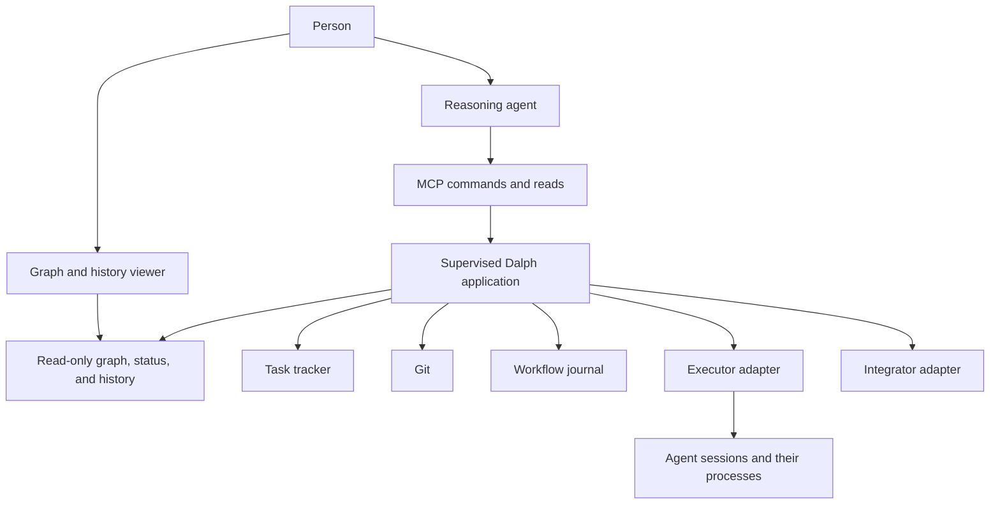

# Dalph operated by agents

Status: design exploration, 2026-09-13. These are candidate behaviors, not an
accepted specification or an implementation plan. This change adds research
prose only; it changes no executable source, configuration, or Dalph runtime
behavior. The existing glossary and architecture remain unchanged.

## Start with what the person sees

Alice asks a reasoning agent to deliver a feature represented by GitHub root
issue R. Issues A and B can proceed independently; C depends on both. Alice
allows two concurrent task attempts. Git has target head H, there are no claims
or worktrees for these tasks, no executor sessions have started, and no Run
beginning has been recorded.

The agent asks Dalph to establish delivery for R under that policy. Dalph
records the Run, reads GitHub, derives eligible work, and admits A and B. It
records exact claim intents before contacting GitHub, fixes each attempt's Base
SHA and worktree, checks Git, and records executor intent before asking the
executor to begin. The agent receives an operation receipt and a Run reference;
it does not have to remember the intervening resource steps.

Alice opens a graph showing A and B executing and C waiting on its two
prerequisites. When B's executor produces an accepted commit, Dalph verifies
the corresponding report, makes its task-work position available, and carries
the separate integration and cleanup obligations forward. B's agent saying
"done" does not itself close B in GitHub. Dalph follows the accepted Git
promotion, tracker reflection, and disposition-specific cleanup protocols.
Only sufficient current tracker facts let the dependent work proceed.

If the reasoning agent disappears, the proposed separately supervised Dalph
host continues according to the policy Alice already authorized. Another agent
can inspect the same Run. If Dalph itself crashes after GitHub applied a claim
but before its response was recorded, restart checks the exact GitHub record
before retrying. A lost response does not create a second task attempt.

Alice sees unresolved work and its exact reason. She must never see a falsely
free position, a deleted worktree with an active writer, a duplicate Begin, or
a closed task inferred solely from an agent's message. Candidate acceptance
seams S1–S4 below cover this chronology; they have not been implemented here.

## Standing requirements for this exploration

The user's 2026-09-13 direction adds two further requirements to the original
agent-operated delivery and graph-visibility discussion. Preserve all four when
evaluating executor choices and architecture alternatives:

1. Dalph supports being both an invoker and an invokee, potentially at the same
   time. A person can run it autonomously without an orchestrator agent; an
   agent can also direct it. Routine delivery and bookkeeping must not depend
   on a conversation remembering each next step.
2. The person can inspect the task graph and frontier on demand and follow
   updates while work proceeds. Initial granularity is tasks, assigned or not,
   plus an optional opaque executor association. Detailed executor views are
   later work.
3. The person can connect to an agent and help directly whenever that provider,
   host, session type, and current state technically permit it. Prefer the
   host's organic, native interaction; do not assume a custom Dalph interaction
   standard is desirable. Showing a
   transcript, sending an answer, steering work, and taking over a checkout
   are different capabilities; expose the actual supported choice.
4. Planning can recur within delegated task scopes. A planner or implementer
   may discover more work, add authorized tasks beneath its scope, and hand
   control back so the parent and Dalph can act on the changed graph while
   respecting execution bounds. A permanently fixed task graph or mandatory
   one-level planning hierarchy would defeat this requirement.

These are standing product requirements for the exploration, not acceptance of
the specific new runtime protocols suggested below. New capabilities still need
accepted chronological scenarios before implementation. Keep both ongoing
recursive planners and short planning interventions open as design alternatives.

## Interview clarifications: reporting and workflow choices

The active [interview](invoker-invokee-interview.md) records later user decisions
that qualify the design proposals in this note:

- MCP is likely one reporting route, but reporting is unreliable.
- Q26 confirms existing single-root Run scope is sufficient. Arbitrary task
  selection is outside the plan, not a deferred feature. Refreshing specified
  IDs is a separate operation and does not select work for execution.
- Q25 selects the first useful milestone: an agent connects to already-running
  Dalph through MCP or CLI, inspects graph/frontier, requests work, and adjusts
  capacity using existing Dalph-managed executors. Caller-launched worker
  registration/release remains a separate research/prototype track.
- Q24's implementer ending unfinished to allow newly authored prerequisites to
  execute is accepted later work in the current planned core Dalph feature set,
  including autonomous use; it is not an MCP-specific requirement.
- One Run per repository initially; multiple independent Runs are later work.
- The caller need not select an executor. Capacity remains a separate control;
  a startup capacity argument is a candidate interface, not a selected syntax.
- Dalph chooses tasks in the first implementation. Prioritization, potentially
  through the tracker, is later work.
- The first implementation acts on observed tracker state even between separate
  authoring calls. A newly created D can start before its blockers are added.
  Earlier publication-barrier proposals below are not initial requirements.
  Visible readiness labels, drafts, tags, or editing conditions are later options.
  This does not permit treating an incomplete provider read as a complete graph.
- The graph-change notification is only "refresh your graph" or "refresh the
  subgraph of these IDs". Tracker facts are read from the tracker; the proposed
  graph-publication tools below are not the selected notification interface.
- Support for workers without reliable observation is optional if small and
  natural; otherwise retain it as a later possibility.
- Authorized delivery continues without requiring knowledge of whether the
  orchestrator is online. "Handback" below is an explored arrangement, not a
  requirement for a callback or an online receiving parent.
- Decomposition approval belongs to the user's workflow and instructions.
  Dalph-provided parent/child conversation, questions, or notification services
  below remain proposals; none is an accepted product requirement.
- Distinguish first-priority capabilities from important later possibilities.
  The initial graph shows tasks and optional opaque executor associations;
  detailed executor/helper views are later work.
- Do not infer parent-task execution or completion rules from grouping. Explicit
  prerequisites determine dependency readiness; satisfying them does not
  complete the dependent task. Grouping still serves membership and scoped
  controls. Earlier parent-completion alternatives below are unselected research.
- A lease obtained through MCP might fit as an executor implementation. This is
  a hypothesis for a composable design, not an accepted type or a second
  lifecycle model. Registration and release still need research/prototyping.

## Recommendation

Let the reasoning agent choose goals, decomposition, and responses to novel
problems. Let Dalph carry out the already authorized delivery policy and retain
every unfinished responsibility. MCP provides one interface to that service.
The service lifetime must be independent of a tool request and, for the default
proposal, independent of the reasoning agent's client connection.

This still permits Dalph to launch agent processes technically. The product
inversion is who supplies intent and judgment. Removing Dalph's automatic
reconciliation and scheduling would put the bookkeeping back into the agent's
conversation.

One repository coordinator retains the existing exclusive mutation rule. MCP
connections and the browser are clients, not additional coordinators. An
agent-facing stdio shim could connect to the same host without making closing
stdio mean stopping the Run. Explicit application Exit still follows its own
accepted protocol. Disconnect, Run Pause, cancellation, and application Exit
must remain different events.

## What should the agent decide?

| Reasoning agent supplies | Dalph determines and executes |
| --- | --- |
| Goal and acceptance criteria | Fresh task/dependency observations and frontier |
| Proposed decomposition and dependency changes | Tracker changes through an accepted, recoverable boundary |
| Authorized executor profile and task capacity | Exact admission, claim, worktree, Base, and executor correlation |
| Answers to workers' questions | Message routing and whether the exact attempt can receive the answer |
| A choice for a concrete unresolved exception | Stale-choice rejection and the permitted subsequent protocol |
| Permission to deliver under an agreed policy | Integration, tracker reflection, cleanup, and reconciliation |

The agent should not call "release position", "delete worktree", and "close
issue" after every successful child. Those are consequences of evidence and
policy. Routine implementation freedom inside a worktree remains with its
executor. Delivery authority stays with Dalph and the relevant outside system.

The current actor vocabulary describes Operator as human. An authenticated
agent acting under a person's grant would be a new accepted boundary design;
silently writing all its decisions as human Operator actions would be wrong.
Agent-authored graph edits, priority changes, and richer executor selection are
also candidate extensions, not claims about today's supported controls.

## A small interface, with meaningful results

Illustrative operations, not proposed exact API names:

| Request | Meaning |
| --- | --- |
| `establish(root, policy, requestId)` | Accept one durable delivery request and return its exact Run reference |
| `inspect(run, focus)` | Return graph, frontier, outstanding responsibilities, freshness, and permitted choices |
| `propose_graph_change(scope, changes, expectedFacts, requestId)` | Validate and apply a bounded tracker edit through the tracker boundary |
| `answer(question, expectedOccurrence, answer, requestId)` | Route one answer to the exact waiting attempt |
| `direct(subject, expectedOccurrence, choice, requestId)` | Apply an authorized pause, continuation, or exception choice |
| `watch(run)` | Observe changes without authorizing workflow actions |

Long work returns a receipt quickly. Receipt states distinguish accepted,
applied, rejected, and unresolved; "tool call succeeded" cannot stand in for
"work delivered". Exact repeat requests return the previous outcome, while
different payloads under the same request identity are rejected. Any external
effect whose result is uncertain is checked at its destination before retry.

An inspection should explain the next meaningful decision. Example:

> A and B are executing. C waits for both tracker prerequisites. D is eligible
> but both task positions are occupied. B has asked whether its change must
> preserve the old API; answering that question is currently permitted.

Graph-view positions are not authorization. Before changing anything, Dalph
checks the named subject and relevant current evidence. A cached list of
permitted choices is a convenience, not a reusable grant.

Task creation itself has a hard ambiguity case: GitHub creates a child issue
but Dalph loses the response. A client request ID alone cannot deduplicate a
GitHub mutation. The accepted protocol would need a recoverable correlation
that can be found in the tracker, or preserve uncertainty without blindly
creating another child. Multi-call graph edits also need declared intermediate
states because tracker APIs need not provide graph-wide transactions.

## Who executes?

Three arrangements are viable, with different guarantees.

1. **Dalph starts an independently addressable agent session.** The executor
   adapter binds it to the planned attempt, observes it, routes messages, and
   proves its owned activity stopped. This best supports a replaceable
   reasoning agent. A resumable conversation alone does not prove a live
   process survives disconnect or can be adopted safely.
2. **The orchestrator's host supplies native children.** This offers familiar
   conversation and delegation, but requires an adapter in that host. It must
   expose exact start correlation, passive observation, interruption, and
   descendant/process completion. An opaque child ID returned in conversation
   is insufficient. Start must follow admission; launching and registering
   afterward leaves an unaccounted crash window.
3. **Workers pull admitted assignments.** A separately supervised worker pool
   receives exact attempt assignments. This can support remote machines or
   several providers, but adds worker identity, fencing, assignment ambiguity,
   and remote Git topology. It is a later design, not the cheapest local MVP.

Use arrangement 1 first, permit 2 where a host adapter qualifies, and defer 3
until remote execution is a real requirement. The same coarse executor
contract can hide one coder, coder plus reviewer, or another internal algorithm.
Messaging addresses the logical attempt and resolves its current session; a
stale session ID should never direct a replacement attempt accidentally.
Question and message routing would be a new adapter boundary: today's generic
executor contract exposes Begin, Resume, Suspend, and observation, not messaging.
An answer must not implicitly Resume a suspended attempt or start a concurrent
provider turn. Its delivery and application require their own exact semantics.

Sources and host-specific limitations are in
[the executor investigation](agent-driven-executors.md).

## Handles: permission and correlation, not remembered obligations

Suppose worker W receives permission to inspect A, submit A's result, and ask a
question. A handle should bind that permission to the exact Run and attempt,
its recipient, allowed operations, and the grant's current validity. W cannot
use it to close B, remove an arbitrary path, enlarge capacity, or grant itself
more rights. Scope checks happen at each command boundary.

Distinguish proposed concepts before designing types:

- **Run reference:** identifies what to inspect; possession alone grants no mutation.
- **Attempt reference:** identifies exactly one planned course of work.
- **Delegation grant:** records who may request which actions for which subjects.
- **Command receipt:** identifies one request and its observed disposition.
- **Result submission:** presents evidence for an attempt; it does not prove integration.
- **Question:** identifies an unresolved worker decision and its possible answer occurrence.

These are candidate terms, not amendments to `CONTEXT.md`. Session and process
locators remain owned inside the executor implementation. Tracker task IDs do
not become grant IDs or conversation IDs.

"Returning the handle" can mean submitting results or relinquishing permission,
but cannot be required for Dalph to discover unfinished work. Nor does handle
expiration prove that a child or its shell commands stopped. Losing a grant
can stop new authorized calls; revoking actual filesystem access requires host
enforcement. A token alone cannot fence a process already writing files.

Completion revokes further work permission only through the applicable
protocol. A new orchestrator can receive a new scoped grant to an existing Run
without creating replacement executor work. Competing orchestrators require
subject-specific stale-command checks and an accepted grant policy, even
though Dalph still has just one repository mutation owner.

## A person joins a worker

Alice opens task A in the graph while its exact executor is working. The view
shows which forms of interaction the current host and session actually support:
inspect its conversation, answer a question, queue a message, steer its current
turn, open an interactive client, or request control of its checkout. These
must not collapse into one promise that every provider supports an "attach".
The adapter checks current session identity and capability when she acts; a
link saved before replacement must not silently reach another attempt.

Direct help need not pass through the parent conversation where the provider
supports a direct route. Where it does not, show the limitation and offer the
supported parent-mediated route without presenting that as a direct connection.
Prefer executor arrangements with supported human interaction when selecting
between otherwise suitable providers. Preserve less interactive executors as
options for work whose policy does not require direct intervention.

Reading a transcript changes no permission or scheduler state. Sending advice
does not transfer execution ownership. Opening another client does not prove
that it can safely become a second writer. If Alice wants to edit the checkout
herself, a candidate handoff protocol must prevent conflicting continuation and
cleanup, obtain exact proof that executor-owned writers stopped, and only then
grant the intended edit access. Ordinary Run Pause alone must not be assumed to
provide this exclusive human handoff.

When Alice finishes, Dalph checks the exact worktree, branch, accepted task
instructions, claims, and relevant Git facts before allowing the next accepted
action. Her work remains subject to the ordinary integration and delivery
evidence; manual help does not itself close the issue. Disconnecting her editor
or browser does not prove that her commands stopped or that automated work can
resume. A handoff needs a recoverable end or resolution, not a timeout that
silently reclaims the checkout.

The parent agent should see that human interaction occurred and learn any
resulting task or scheduling change. It does not need a duplicate transcript of
every conversational aside. An instruction changing acceptance criteria must
reach the tracker-authored task specification through an accepted change;
private chat history cannot become a competing authoritative specification.

[Human interaction research](agent-human-interaction.md) records provider and
client distinctions. These are proposed workflow behaviors, not an existing
generic messaging or manual-edit feature in Dalph.

## The graph and frontier

The interview fixes the initial view at task granularity, whether assigned or
not, plus an optional opaque executor association. The browser and agent should
consume the same descriptive source. The following richer views were explored
before that scope decision; executor internals are later possibilities, not an
initial requirement. Keep their edge meanings distinct:

- Tracker dependencies and grouping: what must be delivered and what blocks it.
- Attempt and obligation overlays: work in progress, retained worktrees,
  integration, tracker reflection, and cleanup still owed.
- Optional executor detail: who delegated to whom, questions, and provider
  observations. Such observations do not become tracker tasks automatically.

The default highlights eligible tasks, tasks actually executing, and tasks
waiting on capacity with separate encodings. Clicking a node explains its
blockers and evidence. Existing unfinished obligations remain visible even if
a task leaves the current tracker graph.

On-demand reading returns the latest known projection with its tracker
observation time, coverage, and disconnected/stale status. An explicit refresh
request enters the existing coalesced reader rather than letting each browser
or child poll GitHub. Reading history or subscribing does not itself mutate
GitHub, Git, or the journal.

Realtime means updates follow accepted observations and local runtime changes;
it does not mean an atomic realtime GitHub snapshot. The local service can
publish current state plus subsequent changes. Slow clients may receive a
replacement snapshot. After a delivery gap or restart, rebuild the projection;
do not store a derived frontier as workflow authority. Historical cursors use
the journal's existing identity, while live view update positions remain
process-local and separate. Keep a selected historical frame fixed while
showing current status independently.

MCP compatibility details, including version-dependent subscription and task
support, are in [the MCP investigation](agent-driven-mcp.md). Browser updates
may use the host's own stream. A notification that reaches an MCP client does
not necessarily wake a reasoning model: a client-side scheduling hook or an
explicit bounded wait/read is still required.

## Capacity, nesting, and cleanup

Existing Dalph policy releases a task-work position after an exact terminal or
safe-suspension report. It does not hold that position until all integration
and cleanup finish. Keeping those outstanding obligations visible is essential
to explain why "two positions free" can coexist with "three resources retained".
See [ADR 0009](../docs/adr/0009-separate-frontier-from-bounded-admission.md).

Task-attempt capacity is not automatically a limit on every internal model
session or shell process. Two admitted attempts could each use several private
reviewers. If Alice means "at most four agent sessions total", a second,
explicit host-enforced budget is necessary; silently redefining the current
task capacity would break its meaning. Integration has its separate resource
bound. Retained worktrees or provider spend could require future policy limits
with admission backpressure, never deletion inferred from age or budget.

Nested delegation can deadlock if every parent occupies a position while
waiting for children that need those same positions. Two useful choices:

- Keep short private research/review helpers inside one executor, with a
  separate explicit executor-internal concurrency limit.
- Represent durable child delivery work in the tracker, and let the planning
  conversation wait outside task-work capacity. If an already executing parent
  must become such a supervisor, it needs an accepted suspension/splitting
  protocol first; a text report of "waiting" does not free its position.

Merging is separate too: children with independent worktrees require explicit
Git integration. Sibling conversation does not transfer commits or justify
using a newer Base for an existing attempt.

Cleanup is a recorded obligation whose protocol can resume without the agent.
Dalph proves writers stopped or transferred, checks the exact Git resource,
records disposition-specific intent, requests disposal, and checks the result.
Branch deletion follows proven worktree cleanup under existing rules. Missing
or contradictory evidence preserves the resource and exposes the unresolved
reason. This guarantees remembered obligations and safe progress when the
required systems respond; it cannot guarantee deletion during permanent
provider failure.

## A worker decides its task needs children

Alice assigned delivery task A. Its worker discovers that it needs A1 for a
parser change and A2 for a migration, with A2 depending on A1. The worker has
permission to propose work under A. Its result can be "this decomposition is
ready" without claiming that A's requested feature was delivered.

A candidate protocol records the exact proposed graph edit, applies the child
creation/grouping/dependency calls through the tracker, and observes the
result. It must prevent admission from a partially published plan. Lost
responses are reconciled before repeated creation. Dalph then exposes the new
tasks and their frontier to the parent; the parent need not reconstruct the
tree from a prose summary. Recording a proposal, observing published tracker
facts, proving the worker stopped, and establishing delivery success remain
separate events.

Attaching children under A does not by itself block A, change its title/body
fingerprint, or suspend its running executor. The accepted split must state
which explicit dependencies make A wait and what its future acceptance role
will be. A non-executable grouping-only parent would be a new task distinction;
the present graph does not supply that behavior merely because A has children.

If the worker was executing A, its capacity becomes available only through the
accepted safe-suspension or terminal protocol. A planning handback cannot be
silently encoded as accepted delivery, failure, or proof of suspension. If a
new result category is necessary, it needs an accepted executor-boundary
extension. No frozen parent conversation or dormant "wait for children" fiber
should reserve future execution capacity by itself.

A1 may discover A1a and A1b in exactly the same manner. Each planner's authority
remains bounded by its grant. Being able to see a shared prerequisite does not
authorize editing it, and moving a task into a different grouping must not
silently expand a grant. Check dependency cycles and actual provider nesting
limits. Infinite expansion also needs explicit policy limits on created work
or spend, distinct from the number of simultaneously executing attempts.

Two arrangements remain open:

- A continuing planner watches its scope and revises it over time. Its model
  activity requires a declared budget, but merely retaining its conversation
  does not occupy a task-execution position.
- An implementer performs a short planning intervention, publishes or proposes
  the decomposition, and returns control. Its parent or a later agent can
  coordinate the resulting tasks from recorded state.

The recommended initial composition shares one Dalph repository coordinator
and execution admission pool across both arrangements. Planning can recurse
without each planner starting an independent scheduler with another full copy
of the capacity limit. This is not a decision against future hierarchical
scheduling: such a design would need explicit budget partition and ownership
protocols before claiming the same global bound.

Existing partial code makes the handback more demanding. A's current worktree
and Base remain exact; creating children does not authorize deleting, copying,
rebasing, or recreating it. Decide explicitly whether useful partial work is
delivered as a prerequisite, retained in the suspended attempt, or carried by
another accepted transition. Child work must not depend on unpublished files
that exist only in A's checkout.

After the children finish, A still needs its acceptance criteria checked.
Depending on the accepted task structure, that may require resuming A, an
explicitly authorized new attempt, or a separate verification task. Do not
automatically restart the same implementer and make it repeatedly discover the
same decomposition. Nor should completing all children automatically close A.

The [recursive-planning investigation](recursive-planning.md) explores these
choices and the existing graph/tracker seams. Recursive planning is a standing
requirement; its handback, publication, and continuation protocols remain open.

## Is every child a tracker task?

This is the largest product fork. Durable independent delivery work belongs in
the configured tracker. Short private reviewer/research sessions can remain
executor details and return evidence without polluting GitHub Issues.

If the intended product is a general scratch graph for arbitrary agents, with
no tracker records or Git work, that needs a separately designed task-tracker
implementation and a non-repository work contract. It should not become a
second authoritative task table inside the workflow journal. The exact-worktree
and Base invariant cannot simply be ignored for a newly invented task class.

Start with agent-operated repository delivery. Explore a local tracker or
general work graph as a distinct product decision once its real scenarios are
clear. Finishing all children also does not automatically establish the
parent's acceptance criteria: system-level validation may require another
explicit task.

## Candidate scenario-to-test mapping

These are test seams to add after scenario acceptance, not claims of passing
tests or a behavior-changing implementation handoff.

| Scenario | Visible result and exact acceptance seam |
| --- | --- |
| S1: Alice delegates R twice after losing the first response | Same Run/receipt; assert one Run beginning and no duplicate attempt Begin |
| S2: The reasoning agent disconnects while A executes | Under the proposed continue policy, A remains accounted for; reconnect observes same attempt; no Pause/Exit inferred from disconnect |
| S3: Dalph loses a GitHub claim response and restarts | Assert exact claim reread precedes any retry and only the same planned attempt proceeds |
| S4: B reports success but GitHub completion cannot be confirmed | B's executor capacity is released only on its qualified terminal report; integration/reflection obligations remain; C is not admitted from prose success |
| S5: A child returns or loses its handle while a descendant writes | No worktree deletion or position release from the handle event; assert executor stop proof is required |
| S6: Two admitted parents request new tracked children | Accepted nesting policy allows progress without exceeding task or host session bounds; test all-parent-waiting case as a negative control |
| S7: Alice's browser misses updates and reconnects | Rebuild current view with freshness; historical cursor unchanged; assert view reads call no mutation boundary |
| S8: A stale child submits for a replaced attempt or sibling | Reject exact mismatch before Git/tracker/executor mutation |
| S9: Cleanup response is lost after Git removed the exact worktree | Reobserve the exact resource before retry; unrelated worktree is preserved; branch disposal obeys its own precondition |
| S10: GitHub creates a child but its response is lost | Reconcile recoverable tracker correlation, or retain unresolved creation; never blindly create a duplicate |
| S11: An agent answers an obsolete worker question | Reject obsolete occurrence; do not deliver answer to a different attempt/session |
| S12: Client requests cancellation of an outstanding read/tool call | Cancel only the requested observation unless an explicit authorized workflow command was issued; do not conflate transport cancellation and Run cancellation |
| S13: Alice opens a worker that cannot accept direct input in this host | Offer the supported observation or mediated interaction; do not claim attachment, start replacement work, or silently resume it |
| S14: Alice takes over A's checkout, then her browser disconnects | Require exact stop proof before the handoff; preserve the unresolved human handoff after disconnect; no conflicting resume or cleanup |
| S15: A's worker publishes A1/A2, hands back, and A1 decomposes again | Parent reads the revised graph; all levels use the declared execution bound; no slot release from prose handback and no premature parent completion |
| S16: Alice changes A's requirements while its worker submits a decomposition | Check the relevant task and scope facts before publication; reject or reconcile obsolete changes without blocking unrelated scopes |
| S17: A planner crashes between creating a child and adding its blockers | Preserve exact graph-edit responsibility; resolve partial tracker state before admission; never duplicate a child or run it with missing blockers |

The accepted scenario documents must expand each extension's starting facts,
ordered boundary calls, crash points, retry outcomes, and governing invariants
before implementation. Existing protocols are reused rather than re-specified
by this research table.

## Evidence and limits

- [Repository assessment](agent-driven-repo-assessment.md): source seams,
  existing tests, deployment gaps, and documentation/source discrepancies.
- [Executor research](agent-driven-executors.md): official provider capabilities
  and the limits of native child/session handles.
- [MCP research](agent-driven-mcp.md): official protocol evidence and client
  compatibility constraints.
- [Human interaction](agent-human-interaction.md): direct conversation, mediated
  steering, observation, and manual handoff are separate capabilities.
- [Recursive planning](recursive-planning.md): scoped task creation, handback,
  partial publication, and parent acceptance without duplicated admission.
- [Architecture](../docs/ARCHITECTURE.md),
  [glossary](../docs/CONTEXT.md), and
  [operational scenario gate](../docs/OPERATIONAL-SCENARIOS.md) remain the
  governing repository sources.

Review disposition: retain autonomous runtime supervision because otherwise
the reasoning agent must remember each next protocol action. Reject
handle-return-based cleanup because a lost client and active descendants defeat
it. Reject conflating task capacity with total sessions because the existing
executor boundary hides its private algorithm. Defer worker pools and general
scratch-task graphs because they add new authority and failure scenarios beyond
the local repository proposal. No provider mutation or implementation gate was
run for this prose-only investigation.
