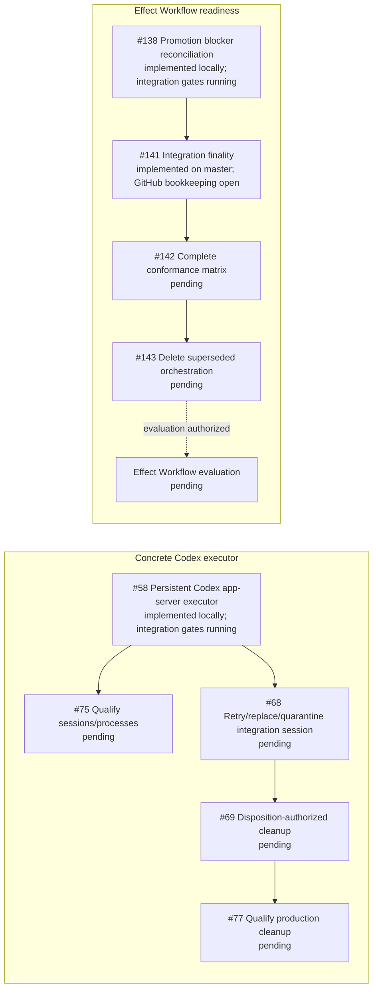

Completed prerequisites are removed from the active graph. Issue #66 was
integrated and closed on master at `147a1774b`; #167 was integrated on master
at `8fd47e052`; #127 accepted the opaque planned-attempt executor boundary and
closed at `2769e1c63`. Issue #168 was integrated at `78ed1b3e3`, making generic
Dalph production-capable without choosing an executor's private algorithm.
Issue #140 was integrated at `d606b63fd`, adding fail-closed normalized
projection outcomes without exposing executor internals.

#219 selected one simple persistent Codex app-server executor and explicitly
rejected a required review loop. #220 now supplies the tracker-authored task
instructions to the generic executor boundary. #58 implements the selected
private app-server/thread behavior; its local implementation is undergoing the
combined integration gates before it is pushed and closed. #75 then qualifies
its real session and process lifecycle. The integration-session and cleanup
chain continues independently through #68, #69, and #77.

The concrete executor branch does not block the focused Effect Workflow
evaluation. That readiness lane converges the completed #137 and #139 work with
the locally implemented #138 behavior at #141. #141's implementation is already
on master, while its GitHub issue remains open for bookkeeping and combined
prerequisite verification. After that convergence is recorded, #142 and #143
remain in order. Closing #143 authorizes evaluation, not adoption.
