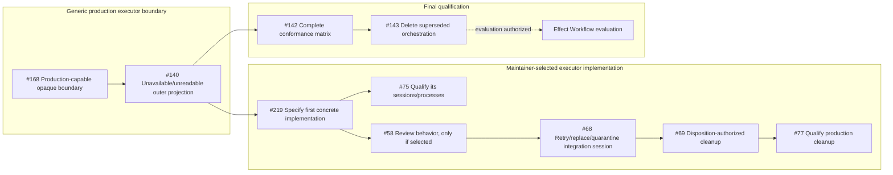

Completed prerequisites are removed from the active graph. Issue #66 was
integrated and closed on master at `147a1774b`; #167 was integrated on master
at `8fd47e052`; #127 accepted the opaque planned-attempt executor boundary and
closed at `2769e1c63`. Issue #168 is now the active implementation node. It
makes generic Dalph production-capable without choosing an executor's private
algorithm, and #140 adds fail-closed normalized projection outcomes.

After #140, #219 is an explicit maintainer decision rather than an autowork
implementation ticket. It selects and specifies a concrete executor only when
the project intentionally chooses one. #75 qualifies that selected
implementation. #58 proceeds only if #219 selects review; otherwise #219 must
close or rewrite it. The integration-session and cleanup chain then continues
through #68, #69, and #77.

The concrete-implementation branch does not block the focused Effect Workflow
evaluation. That evaluation remains blocked by #168, #140, #142, and #143 in
that order. Closing #143 authorizes evaluation, not adoption.
