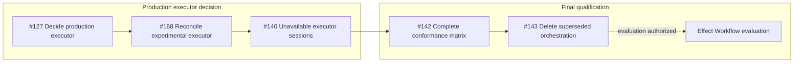

Completed prerequisites are removed from the active graph. Issue #66 was
integrated and closed on master at `147a1774b`; #167 was integrated on master
at `8fd47e052`. Issue #127 is now the active entry node for the production
executor decision. Effect Workflow evaluation remains blocked by #127, #168,
#140, #142, and #143 in that order.
