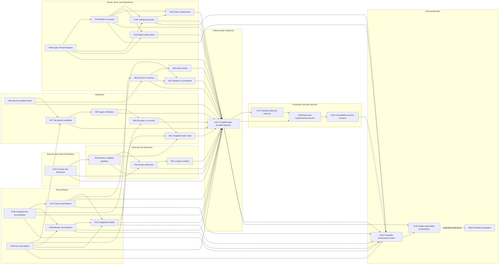

```mermaid
flowchart LR
  subgraph executor["Executor and event foundations"]
    i131["#131 Frontier and admission"]
  end

  subgraph traversal["Traversal and admission"]
    i53["#53 Refresh complete pipelines"]
    i54["#54 Resize admission"]
    i55["#55 Localize conflicts"]
  end

  subgraph integration["Integration"]
    i56["#56 Queue accepted result"]
    i57["#57 Two-parent candidate"]
    i59["#59 Target verification"]
    i60["#60 Promote or reconcile"]
    i61["#61 Complete tracker task"]
  end

  subgraph reconciliation["Reconciliation"]
    i136["#136 Changed task reconciliation"]
    i137["#137 Claim reconciliation"]
    i138["#138 Blocker reconciliation"]
    i139["#139 Git reconciliation"]
    i141["#141 Integration finality"]
  end

  subgraph controls["Pause, drain, and dispositions"]
    i166["#166 Apply Pause/Unpause"]
    i134["#134 Whole-run pause"]
    i135["#135 Task/group pause"]
    i156["#156 Reject stale pause"]
    i63["#63 Drain to quiescence"]
    i65["#65 Cancel or continue"]
    i66["#66 Clean restart"]
    i67["#67 Abandon or quarantine"]
  end

  subgraph milestone["Fake-provider milestone"]
    i167["#167 Complete fake-provider behavior"]
  end

  subgraph production["Production executor decision"]
    i127["#127 Decide production executor"]
    i168["#168 Reconcile experimental executor"]
    i140["#140 Unavailable executor sessions"]
  end

  subgraph final["Final qualification"]
    i142["#142 Complete conformance matrix"]
    i143["#143 Delete superseded orchestration"]
    effectWorkflow["Effect Workflow evaluation"]
  end

  i131 --> i53
  i53 --> i54
  i131 --> i54
  i54 --> i55

  i56 --> i57
  i139 --> i57
  i57 --> i59
  i59 --> i60
  i139 --> i60
  i53 --> i61
  i60 --> i61
  i141 --> i61

  i136 --> i137
  i136 --> i138
  i139 --> i138
  i137 --> i141
  i138 --> i141
  i139 --> i141

  i166 --> i134
  i134 --> i135
  i166 --> i135
  i134 --> i156
  i166 --> i156
  i134 --> i63
  i135 --> i63
  i56 --> i65
  i136 --> i65
  i65 --> i66
  i65 --> i67
  i137 --> i67

  i53 --> i167
  i54 --> i167
  i55 --> i167
  i56 --> i167
  i57 --> i167
  i59 --> i167
  i60 --> i167
  i61 --> i167
  i63 --> i167
  i65 --> i167
  i66 --> i167
  i67 --> i167
  i131 --> i167
  i134 --> i167
  i135 --> i167
  i136 --> i167
  i137 --> i167
  i138 --> i167
  i139 --> i167
  i141 --> i167
  i156 --> i167
  i166 --> i167

  i167 --> i127
  i127 --> i168
  i167 --> i168
  i168 --> i140

  i134 --> i142
  i135 --> i142
  i136 --> i142
  i137 --> i142
  i138 --> i142
  i139 --> i142
  i140 --> i142
  i141 --> i142
  i167 --> i142
  i142 --> i143
  i167 --> i143
  i143 -. evaluation authorized .-> effectWorkflow
```
