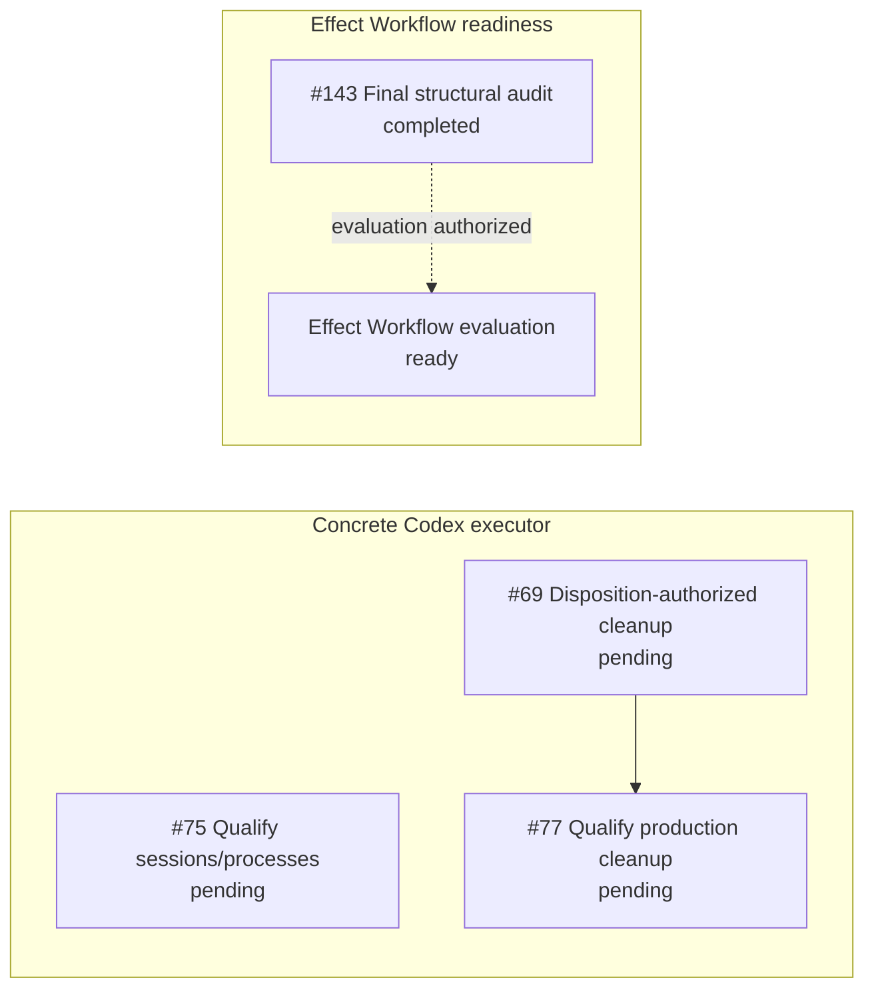

Completed prerequisites are removed from the active graph. Issue #66 was
integrated and closed on master at `147a1774b`; #167 was integrated on master
at `8fd47e052`; #127 accepted the opaque planned-attempt executor boundary and
closed at `2769e1c63`. Issue #168 was integrated at `78ed1b3e3`, making generic
Dalph production-capable without choosing an executor's private algorithm.
Issue #140 was integrated at `d606b63fd`, adding fail-closed normalized
projection outcomes without exposing executor internals.

#219 selected one simple persistent Codex app-server executor and explicitly
rejected a required review loop. #220 supplies the tracker-authored task
instructions to the generic executor boundary, and #58's private
app-server/thread implementation is integrated and closed. The remaining
concrete-executor work has two ready roots: #75 qualifies the real Codex session
and process lifecycle, while the independent cleanup chain continues through
#69 and #77 after the completed integration-session work in #68.

The concrete executor branch does not block the focused Effect Workflow
evaluation. That readiness lane completed #138, #141, #142, #143, and their
blocking integration-boundary work. This authorizes a focused evaluation of
`effect/unstable/workflow`; it does not authorize adoption.
