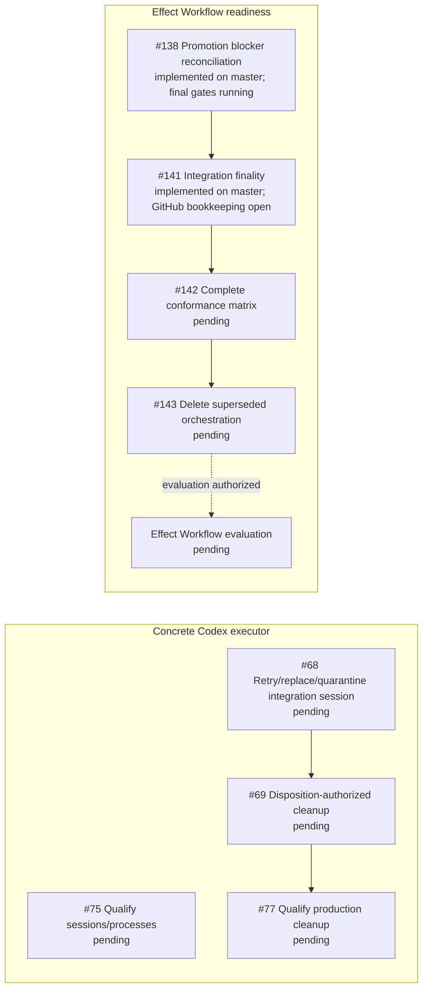

Completed prerequisites are removed from the active graph. Issue #66 was
integrated and closed on master at `147a1774b`; #167 was integrated on master
at `8fd47e052`; #127 accepted the opaque planned-attempt executor boundary and
closed at `2769e1c63`. Issue #168 was integrated at `78ed1b3e3`, making generic
Dalph production-capable without choosing an executor's private algorithm.
Issue #140 was integrated at `d606b63fd`, adding fail-closed normalized
projection outcomes without exposing executor internals.

#219 selected one simple persistent Codex app-server executor and explicitly
rejected a required review loop. #220 supplies the tracker-authored task
instructions to the generic executor boundary, and #58's private
app-server/thread implementation is integrated and closed. The remaining
concrete-executor work has two ready roots: #75 qualifies the real Codex session
and process lifecycle, while the independent integration-session and cleanup
chain continues through #68, #69, and #77.

The concrete executor branch does not block the focused Effect Workflow
evaluation. That readiness lane converges the completed #137 and #139 work with
the implemented-on-master #138 behavior at #141. #141's implementation is also
on master, while both GitHub issues remain open for final combined verification
and bookkeeping. After that convergence is recorded, #142 and #143 remain in
order. Closing #143 authorizes evaluation, not adoption.

## Paused-goal checkpoint before performance work

The ticket goal is intentionally paused while the ten-task in-memory acceptance
Run is made fast enough for ordinary development. The clean performance
baseline is `210731092`; `origin/master` was `aac2e6083` when this checkpoint
was recorded. The consolidated implementation commits before this document
are:

```text
f095d11ae test: cover workflow verification residuals
210731092 perf: prefilter integration finality events
```

Three clean coverage worktrees remain deliberately unintegrated so the
performance change can be reviewed independently:

| Worktree branch | Commit | Resume action |
|---|---|---|
| `fix/coverage-codex-app-server` | `c963571f8` | Light-review and cherry-pick after the performance milestone, then remove the worktree and branch. |
| `fix/coverage-codex-executor-store` | `576229eee` | Light-review and cherry-pick after the performance milestone, then remove the worktree and branch. |
| `fix/coverage-orchestrator-recovery` | `c59225723` | Light-review and cherry-pick after the performance milestone, then remove the worktree and branch. |

The tracked timing report and this checkpoint document are the only unfinished
primary-worktree bookkeeping. The untracked
`research/verification-bakeoff/TEACHING-SESSION.md` belongs to the user and is
not part of either milestone.
