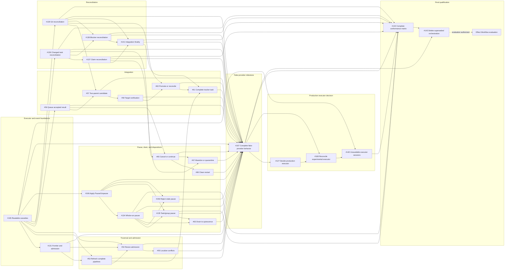

# Remaining issues before the Effect Workflow evaluation

Snapshot date: 2026-07-29, at
[`master` commit `0f964cf2f`](https://github.com/dearlordylord/dalph/commit/0f964cf2fb86a25a45fdce3906d86b6ddbd26d49).

This graph contains every currently open issue in the native prerequisite
closure of
[#143](https://github.com/dearlordylord/dalph/issues/143). Closed prerequisites
are omitted because they no longer need to be completed.

An arrow means **the issue at the tail blocks the issue at the head**. All 29
GitHub issue nodes in this graph must be completed before #143 can close. The
Effect Workflow evaluation is a non-issue destination authorized by closing
#143.

## Count

- Open prerequisite issues before #143: 28.
- Final checkpoint issue #143: 1.
- Total GitHub issues still to complete: **29**.
- Effect Workflow evaluation node: not a GitHub issue.

## Recommended next work

[#164](https://github.com/dearlordylord/dalph/issues/164) is closed after the
[journal-first tracker-observation implementation on
`master`](https://github.com/dearlordylord/dalph/commit/de51cd58bcc7c3291f1fd3e96a378d2a573c1e4f)
and its [example-driven documentation
follow-up](https://github.com/dearlordylord/dalph/commit/311af4e6cb0ff37e17ca02f1dd005b98407f1527).
It and its three outgoing edges to #165, #53, and #167 are therefore omitted
from the remaining graph.

[#158](https://github.com/dearlordylord/dalph/issues/158) also remains closed
after the [acceptance-evidence cleanup on
`master`](https://github.com/dearlordylord/dalph/commit/80d11e05965698b8abec5c64ee8aac19014f94da),
so it and its six outgoing edges remain omitted.

[#165](https://github.com/dearlordylord/dalph/issues/165) is now the **only**
dependency-ready issue in this prerequisite closure: both of its native
blockers, #160 and #164, are closed, and GitHub marks it `ready-for-agent`.
Current `master` contains the maintained authored-cassette protocol, recorded
projection, domain-level behavior assertions, and their acceptance coverage.
The [latest #165 acceptance-evidence
comment](https://github.com/dearlordylord/dalph/issues/165#issuecomment-5126196336)
leaves two explicit issue-owned results before closure: property-generated
valid authored cassettes with validity-preserving shrinking, and the
changed-versus-unchanged observation size report.

There is no second dependency-valid implementation issue to run in parallel
with #165. [#131](https://github.com/dearlordylord/dalph/issues/131),
[#56](https://github.com/dearlordylord/dalph/issues/56),
[#136](https://github.com/dearlordylord/dalph/issues/136),
[#139](https://github.com/dearlordylord/dalph/issues/139), and
[#166](https://github.com/dearlordylord/dalph/issues/166) all retain #165 as
an open native blocker.

Finish those two #165 results, verify them against its accepted scenarios, and
close #165. Its closure releases the first useful parallel wave:
[#131](https://github.com/dearlordylord/dalph/issues/131),
[#56](https://github.com/dearlordylord/dalph/issues/56),
[#136](https://github.com/dearlordylord/dalph/issues/136),
[#139](https://github.com/dearlordylord/dalph/issues/139), and
[#166](https://github.com/dearlordylord/dalph/issues/166).

GitHub's native issue-dependency relation is authoritative. This file is a
dated projection and must be refreshed when issue states or dependency edges
change.
