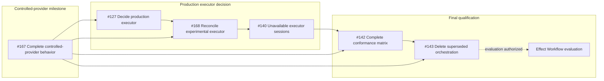

```mermaid
flowchart LR
  subgraph milestone["Controlled-provider milestone"]
    i167["#167 Complete controlled-provider behavior"]
  end

  subgraph production["Production executor decision"]
    i127["#127 Decide production executor"]
    i168["#168 Reconcile experimental executor"]
    i140["#140 Unavailable executor sessions"]
  end

  subgraph final["Final qualification"]
    i142["#142 Complete conformance matrix"]
    i143["#143 Delete superseded orchestration"]
    effectWorkflow["Effect Workflow evaluation"]
  end

  i167 --> i127
  i127 --> i168
  i167 --> i168
  i168 --> i140

  i140 --> i142
  i167 --> i142
  i142 --> i143
  i167 --> i143
  i143 -. evaluation authorized .-> effectWorkflow
```

Completed prerequisites are removed from the active graph. Issue #66 was
integrated and closed on master at `147a1774b`; #167 is now the active entry
node for the controlled-provider milestone.
