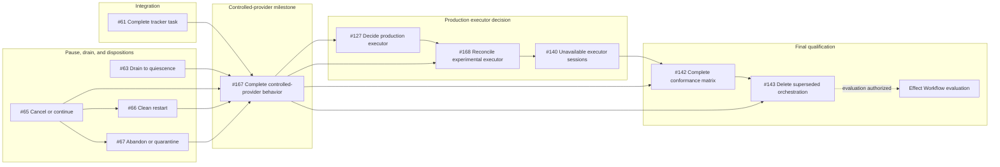

```mermaid
flowchart LR
  subgraph integration["Integration"]
    i61["#61 Complete tracker task"]
  end

  subgraph controls["Pause, drain, and dispositions"]
    i63["#63 Drain to quiescence"]
    i65["#65 Cancel or continue"]
    i66["#66 Clean restart"]
    i67["#67 Abandon or quarantine"]
  end

  subgraph milestone["Controlled-provider milestone"]
    i167["#167 Complete controlled-provider behavior"]
  end

  subgraph production["Production executor decision"]
    i127["#127 Decide production executor"]
    i168["#168 Reconcile experimental executor"]
    i140["#140 Unavailable executor sessions"]
  end

  subgraph final["Final qualification"]
    i142["#142 Complete conformance matrix"]
    i143["#143 Delete superseded orchestration"]
    effectWorkflow["Effect Workflow evaluation"]
  end

  i65 --> i66
  i65 --> i67

  i61 --> i167
  i63 --> i167
  i65 --> i167
  i66 --> i167
  i67 --> i167
  i167 --> i127
  i127 --> i168
  i167 --> i168
  i168 --> i140

  i140 --> i142
  i167 --> i142
  i142 --> i143
  i167 --> i143
  i143 -. evaluation authorized .-> effectWorkflow
```
