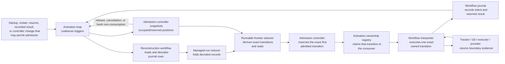

# Issue 132 activation ownership decision

Status: implementation-ready design for
[Activate fresh and recovered work through one loop](https://github.com/dearlordylord/dalph/issues/132).
This decision changes no production control-plane behavior. The implementation
and validation work is bounded by the
[issue 132 implementation handoff](issue-131-handoffs/issue-132-implementation.md).

## Decision boundary

This decision materializes the issue owner's accepted rederive-on-capacity-
change rule. It uses the existing reconstructed managed-run state, runnable
frontier selector, task admission controller, workflow interpreter, and
frontier-recovery Quint model. It does not restore the fixed recovery-phase
dispatcher, retain the controller's dormant waiter queue, or introduce a third
scheduler or verification model.

The tracker, Git, executor, and task-work provider continue to own their current
facts. The Dalph workflow journal continues to own only recorded workflow
history. Selection, reservations, activation ownership, and trigger
coalescing are process-local coordination facts.

## Owner, action, and boundary



The activation loop is the only actor that turns a selected transition into an
owned execution. A trigger never carries a task, transition, priority, or order
key. It only asks the loop to read current reconstructed state and the current
controller snapshot again.

## Ordering traces

### Current facts remain unchanged

Capacity is full. Task Z has an outstanding responsibility begun at journal
position 10; task A has one begun at position 20.

```text
1. The selector derives [Z@10, A@20]; the controller admits neither.
2. A provider observation confirms that the occupied invocation stopped.
3. The controller removes that exact occupied position and signals
   "admission may now be possible."
4. The activation loop rereads managed-run state and the controller snapshot.
5. The selector again derives [Z@10, A@20].
6. The controller reserves the available position for Z.
```

Z proceeds because responsibility order is still the current selector result,
not because a sleeping Z fiber owned the next position.

### Restart observes changed current facts

The starting conditions are identical, but the coordinator crashes while
capacity is full. Before restart, a task-control fact that pauses Z is recorded
through the accepted control boundary and the occupied invocation stops.

```text
1. The selector derives [Z@10, A@20]; the controller admits neither.
2. The coordinator crashes; its frontier, waiters, and controller state vanish.
3. Before restart, the journal gains the task-control fact that prevents Z's
   next forward-progress operation, and the provider stops the invocation.
4. Restart folds current journal history and freshly observes non-consumption.
5. The activation loop reads that managed-run state and the rebuilt controller
   snapshot.
6. The selector explains Z's pause and derives [A@20].
7. The controller reserves the available position for A.
```

Exact recreation of the pre-change or pre-crash frontier is neither required
nor correct. The selector is deterministic for the current inputs.

## Rejected controller-carried order

The rejected alternative stores Z's position 10 and A's position 20 in a
controller queue. With unchanged facts it also chooses Z, but this agreement
does not make it safe:

```text
current selector after Z is paused: [A@20]
controller queue retained earlier:  [Z@10, A@20]
```

The controller must either admit a transition the current workflow forbids or
reimplement enough workflow logic to remove Z. The first result is wrong and
the second makes the controller a second scheduler that must stay synchronized
with frontier derivation. A task- or operation-sorted waiter queue has the
additional defect that registration timing or lexical identity can replace
responsibility order. Both forms are rejected.

## Exact identities

Before intent, the selector returns a `SelectedTransitionIdentity`. It is a
branded process-local value over:

- the exact `RunId`;
- the transition tag;
- the exact subject identity;
- the immutable selector inputs carried by that transition, including a task
  revision fingerprint or predecessor operation identities when applicable.

Equality uses the complete normalized value, not task identity alone. A fresh
derivation may recreate an equal identity, but the identity is not persisted
and creates no workflow responsibility.

When the activation owner records operation intent, the selected workflow
operation receives its durable `OperationId`. The ownership registry atomically
rekeys that entry from `SelectedTransitionIdentity` to `OperationId`, and the
controller binds any matching reservation to the same `OperationId`. Every
request, fresh result check, retry, reconciliation action, and outcome after
that point uses the `OperationId`. Restart may choose a new pre-intent identity
and operation identity; it must retain a recorded post-intent identity and
payload.

## Ephemeral handoff vocabulary

The following values are model/controller presentation state. None is a
journal event or durable workflow lifecycle state.

| Candidate | Decision | Actor, creation, and removal | Relationship to intent |
| --- | --- | --- | --- |
| `Selected` | Accept as `SelectedTransition` | The selector creates it during derivation. The next derivation replaces it. | It exists before intent and creates no responsibility. |
| `Reserved` | Accept as `AdmissionReservation` | The controller creates it atomically while bounding one admission set. It removes it after exact cancellation, release, a matching occupied observation, or process loss. | It starts under `SelectedTransitionIdentity` and binds to `OperationId` after intent. |
| `Granted` | Reject | “Grant” does not say whether capacity was reserved or a fiber obtained exclusive execution. Those are separate actions above and below. | No separate intent relationship exists. |
| `Owned` | Rename to `ActivationOwnership` | The single activation consumer creates it before executing one transition. It removes it after the returned result is recorded or the exact interruption rule completes. | It starts under selected-transition identity and rekeys to operation identity when intent is recorded. |
| `Released` | Reject as a phase | Releasing is the registry/controller action that removes exact ownership or reservation. | A post-intent release keeps the durable operation identity in journal history. |
| `Cancelled` | Reject as a phase | Cancelling removes a pre-effect reservation after the accepted interruption rule proves cancellation is safe. | It cannot erase recorded intent or authorize retry after an ambiguous outcome. |
| `Reconstructed` | Reject as a phase; retain `ReconstructedReservation` as an origin label | On restart the controller creates process-local positions from current configuration, reconstructed responsibility, and fresh invocation observations. | A reconstructed post-intent reservation names the retained `OperationId`; a lost pre-intent reservation is simply rederived. |

## Public API

The production surface must make the activation loop the only transition
consumer:

```ts
interface ActivationLoop {
  readonly signal: (
    cause: ActivationCause
  ) => Effect.Effect<void, ActivationLoopClosed>
}
```

The Layer starts one scoped consumer. `signal` accepts only a cause such as
`Startup`, `Restart`, `Resume`, `WorkflowResultRecorded`, or
`AdmissionMayNowBePossible`; it accepts no transition or order key. Multiple
signals coalesce into another pass.

The following services remain internal to that consumer:

```ts
interface AdmissionController {
  readonly admitNext: (
    frontier: RunnableFrontier
  ) => Effect.Effect<NextAdmissionDecision>

  readonly bindReservation: (
    selected: SelectedTransitionIdentity,
    operationId: OperationId
  ) => Effect.Effect<void, ReservationBindingIssue>

  readonly applyObservation: (
    observation: FreshInvocationCapacityObservation
  ) => Effect.Effect<AdmissionAvailabilityChange>

  readonly cancelReservation: (
    selected: SelectedTransitionIdentity
  ) => Effect.Effect<
    AdmissionAvailabilityChange,
    ReservationCancellationIssue
  >

  readonly releaseReservation: (
    operationId: OperationId
  ) => Effect.Effect<AdmissionAvailabilityChange, ReservationReleaseIssue>

  readonly snapshot: () => Effect.Effect<TaskAdmissionControllerSnapshot>
}

interface ActivationOwnershipScope {
  readonly run: (
    selected: AdmittedTransition,
    run: (
      owned: OwnedTransition
    ) => Effect.Effect<
      WorkflowOperationResult,
      WorkflowInterpreterFailure | WorkflowResultRecordingFailure
    >
  ) => Effect.Effect<
    WorkflowOperationResult,
    WorkflowInterpreterFailure | WorkflowResultRecordingFailure
  >
}
```

`AdmittedTransition`, `OwnedTransition`, and their constructors are not
exported from the activation module. Only the single activation consumer can
call `ActivationOwnershipScope.run`; trigger callers cannot submit transitions
or obtain an ownership capability. The scope creates one owned capability,
executes its callback, and removes that capability before returning. The owned
capability has one internal `recordIntent` operation. There is no public
operation with which a second fiber can claim or execute the same transition,
so duplicate ownership is unrepresentable rather than a recoverable production
branch.

`AdmissionAvailabilityChange` is the tagged union
`AdmissionMayNowBePossible | AdmissionAvailabilityUnchanged`.
`NextAdmissionDecision` is
`NoTransitionAdmitted | ExactTransitionAdmitted`; the admitted variant contains
one transition and, when required, its exact reservation. Neither type carries
an order key.

The accepted controller API removes `awaitAdmission`. Capacity exhaustion is a
returned `CapacityWait` explanation. A later controller change signals the
activation loop, which derives again. The implementation deletes the dormant
waiter queue, its duplicate-waiter guard, and every production call to
`awaitAdmission`.

## One activation pass

One pass performs these concrete actions:

1. The coordinator reads the current reconstructed managed-run state and
   controller snapshot.
2. The selector derives the runnable frontier and exact explanations.
3. The controller computes the bounded admission set but reserves only its
   exact first transition for this pass.
4. The ownership scope creates the exact owned capability in the single
   consumer.
5. The owner records intent when required, invokes exactly that operation
   through `WorkflowInterpreter`, records its exact returned result, releases
   its ownership, and signals the next pass.

The next pass reads current state before choosing another transition, even when
the preceding admission set contained several transitions. Concurrency comes
from provider work already started by earlier bounded workflow operations, not
from sweeping several operations out of one selector snapshot. A pass does not
sweep a broad phase tag, return merely because an unrelated journal event was
appended, or keep a dormant fiber for a capacity wait.

## Restart and configured capacity

Restart discards every pre-intent selection, ownership entry, trigger, and
process-local reservation. It reads the current configured limit, reconstructs
durable responsibilities, and freshly observes provider invocations before
admitting new capacity-consuming work.

Freshly observed occupied invocations are grandfathered for safety:

| Restart case | Fresh observation | Required result |
| --- | --- | --- |
| `8 → 2` | Five invocations still consume capacity. | Keep all five; admit zero until occupied plus reserved is below two. |
| `1 → 2` | One invocation consumes capacity. | Keep it and permit at most one new reservation. |
| `2 → 1` | Two invocations consume capacity. | Keep both; admit zero until usage falls below one. |

The bound applies to new reservations, not by deleting or interrupting current
provider work. Changing capacity in a running coordinator remains issue #54.

After restart, an operation with recorded intent retains its `OperationId` and
is eligible for exact reconciliation ownership. A transition without recorded
intent is reselected from current facts and may receive a new `OperationId`.
An old fiber, lease, selected identity, or delayed release response has no
authority in the new activation. Exact correlation prevents a delayed release
for A-17 from removing A-18.

## Frontier-recovery model extension

ADR 0010 assigns this behavior to the existing `frontierRecovery` model: it
composes graph knowledge, workflow responsibility, capacity, restart, and
reconciliation at the same authority boundary. A third model would duplicate
that composition without a different authority boundary, checking profile,
adapter, lifecycle, or consumer, so it is rejected.

The implementation must add these exact M2 actions to the closed action map and
executable adapter:

| Model action | Observable state change |
| --- | --- |
| `deriveActivationPass` | Replaces selected transitions and explanations from current reconstructed inputs. |
| `reserveSelectedTransition` | Creates a reservation for the exact first transition in the bounded admission set only when future-admission usage is below the configured limit. |
| `claimActivationOwnership` | Atomically creates one owner for one exact selected transition. |
| `recordOwnedOperationIntent` | Records intent, assigns the stable operation identity, and rekeys ownership/reservation. |
| `interruptBeforeOwnership` | Cancels the exact reservation; no owner or intent exists. |
| `interruptAfterOwnershipBeforeIntent` | Removes exact ownership and reservation; later derivation may choose anew. |
| `interruptAfterIntent` | Removes only process-local ownership and retains the exact operation responsibility for reconciliation. |
| `recordOwnedResultAndRelease` | Records the result, removes exact ownership, and signals rederivation. |
| `observeCapacityConsumed` | Replaces a matching reservation with fresh occupied evidence. |
| `observeCapacityReleased` | Removes only the exactly correlated occupied invocation and permits rederivation. |
| `crashWithActivation` | Discards selection, ownership, triggers, and process-local reservations. |
| `reconstructActivation` | Rebuilds positions from current capacity, durable responsibilities, and fresh occupied evidence. |

The model state needs separate selected-transition, reservation, ownership, and
freshly occupied maps keyed by exact identity. `OperationId` is an `Option`
until intent rather than a sentinel. Controller change is modeled as a trigger,
not an ordered queue.

The full invariant set must include:

- `oneOwnerPerExactTransition`;
- `oneExactTransitionPerActivationOwner`;
- `everyOwnerNamesAnAdmittedTransition`;
- `postIntentOwnerUsesStableOperationIdentity`;
- `everyAmbiguityCrossingEffectHasIntent`;
- `newReservationsRespectConfiguredCapacity`;
- `lowerRestartCapacityDoesNotPreemptObservedUsage`;
- `releaseAffectsOnlyItsExactOperation`; and
- `exactActivationIssueDoesNotStopIndependentResponsibility`; and
- `everyResponsibilityIsActionableOrExactlyExplained`.

The negative modules must deliberately produce:

- duplicate ownership for one exact transition;
- a leaked reservation after interruption before intent;
- a delayed release for A-17 that removes A-18;
- a new reservation while observed usage is at or above a lowered limit; and
- the rejected controller-carried ordering trace admitting stale Z after
  current facts pause Z.

Each negative profile must fail its owning invariant. Positive witnesses must
reach ownership before intent, ownership after intent, interruption on both
sides of intent, result release/rederive, fresh non-consumption rederive, and
changed-capacity reconstruction.

## Required executable lanes

The implementation must update the model, action decoder, TypeScript driver,
model projection, comparison, coverage inventory, and gate together.

Required readable and generated lanes are:

1. In-memory `8 → 2`, `1 → 2`, and `2 → 1` reconstruction with fresh occupied
   observations.
2. Closed/reopened SQLite versions of the same three scenarios.
3. Two simultaneous startup/result triggers for one unchanged pre-intent
   transition: the consumer coalesces them and produces exactly one owner and
   one intent.
4. Interrupt before ownership, after ownership/before intent, and after intent,
   with no leaked reservation and correct durable responsibility.
5. A subject-local activation or boundary issue for A while independent C
   remains selectable; only shared history or a shared capability may stop C.
6. Model-based generated sequences covering derive, reserve, own, intent,
   interrupt, result, release, crash, reconstruction, and exact delayed
   correlation.

The adapter must call the production activation, selector, controller, reducer,
and interpreter seams. It must not assign expected state, derive another
scheduler, or treat the bounded model's state types as production types.

## Patch-ready canonical changes

The accepted specification gains the identity, ownership, one-pass, and restart
rules above. ADR 0009 gains the no-waiter controller API consequence. ADR 0010
continues to assign this behavior to M2. The main issue-131 ledger marks H2
returned and H3 handoff-ready without claiming production behavior exists.

Append this exact section to the live issue:

```markdown
## Activation ownership design

The accepted design is
[`research/issue-132-activation-ownership-decision.md`](https://github.com/dearlordylord/dalph/blob/master/research/issue-132-activation-ownership-decision.md).
One scoped consumer receives order-free triggers. Each pass reads current
reconstructed managed-run state and the controller snapshot, derives the
frontier and bounded admission set, reserves and owns one exact transition,
executes one workflow operation, records its exact result, and derives again.

Before intent, process-local `SelectedTransitionIdentity` prevents duplicate
execution. After intent, ownership and any reservation bind to the durable
`OperationId`. Trigger callers cannot submit a transition or obtain ownership;
the single consumer makes a second owner unrepresentable.

The controller exposes no dormant waiter or second order. Restart uses current
configuration, durable responsibility, and fresh occupied-invocation evidence;
it does not preempt observed usage above a lower limit and admits nothing new
until usage permits.

Implementation and validation are bounded by
[`research/issue-131-handoffs/issue-132-implementation.md`](https://github.com/dearlordylord/dalph/blob/master/research/issue-131-handoffs/issue-132-implementation.md).
Production behavior and every acceptance checkbox remain open.
```

No durable event, persisted frontier/resource state, or third model is added by
this design.
