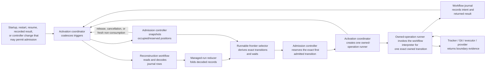

# Exact activation ownership and admission handoff

Status: accepted owner decision from
[Define exact activation ownership and admission handoff](https://github.com/dearlordylord/dalph/issues/151).
Production implementation remains open in
[Activate fresh and recovered work through one loop](https://github.com/dearlordylord/dalph/issues/132).
This decision changes no production control-plane behavior. The implementation
and validation work is bounded by the
[issue 132 implementation handoff](issue-131-handoffs/issue-132-implementation.md).

## Decision boundary

This decision materializes the issue owner's accepted rederive-on-capacity-
change rule. It uses the existing reconstructed managed-run state, runnable
frontier selector, task admission controller, workflow interpreter, and
frontier-recovery Quint model. It does not restore the fixed recovery-phase
dispatcher, retain the controller's dormant waiter queue, or introduce a third
scheduler or verification model.

The tracker, Git, executor, and task-work provider continue to own their current
facts. The Dalph workflow journal continues to own only recorded workflow
history. Selection, reserved task-admission positions, activation ownership,
and trigger coalescing are process-local coordination facts. Dalph is deployed
locally, but coordinator and worker lifetimes remain independently observable:
local deployment does not let recovery infer that a provider-owned process died
with the coordinator. Keeping this boundary explicit also preserves a later
distributed deployment path.

## Owner decisions in this Wayfinder session

1. Before intent, structural `SelectedTransitionIdentity` contains no random
   nonce; unchanged inputs recreate an equal identity. Durable `OperationId`
   replaces it after intent.
2. Capacity reservation is only the behavior-bearing reserved condition of an
   existing task-admission position. It is not a new public phase, journal
   event, or authority fact. Crash recovery reconstructs post-intent capacity
   commitment from responsibility and fresh provider evidence and fails closed
   when that evidence cannot free a position.
3. One activation coordinator serializes selection and admission, then starts
   scoped owned-operation runners that may overlap up to capacity N and other
   resource bounds.
4. The public activation surface exposes only order-free signaling. Selection,
   admission, activation ownership, and runner creation remain private to the
   activation coordinator.
5. Restart capacity changes remain non-preemptive. Actively interrupting excess
   workers to converge immediately to a lower limit is a separate operator
   policy decision, not task pause and not activation behavior.
6. Local deployment does not collapse failure domains in the model or test
   harness. Coordinator death and provider-worker death are separate actions;
   recovery scenarios cover all workers stopped, all surviving, and mixed
   survival.
7. After a live-runtime ownership handoff, the coordinator may derive again.
   A runtime-observed exit before intent releases the exact ownership and
   reserved position. An observed exit after intent removes only the dead
   runner's ownership and retains the position under the `OperationId` recorded
   in journal intent until fresh provider evidence proves whether it is
   occupied or available. Both observed exits signal the coordinator; abrupt
   process death guarantees neither finalization nor a signal, so later startup
   reconstruction is the only recovery trigger.
8. Activation ownership, independent coordinator/worker death, and changed
   restart capacity first extend canonical M2. Verification work must measure
   explored states and wall time and use a predefined profile-decomposition
   fallback if full composition causes material state explosion.
9. Any state-space fallback remains fully model-based-testable: every positive
   action and compared state field stays in the closed executable adapter and
   production projection. Profile decomposition cannot create a
   verification-only behavior or replace action/state correspondence with
   hand-written expected results.
10. The private atomic handoff still detects a second runner attempt for one
    exact transition as a classified `DuplicateActivationOwnershipDefect`. It
    first makes any newly reserved position available, starts no runner or
    external effect, and lets the coordinator supervisor isolate only the exact
    subject unless shared history is invalid. The defect is not an expected
    Effect error.
11. Manual journal mutation is outside the supported threat model; Dalph does
    not add tamper resistance or repair manually altered history. Coordinator
    crashes and storage reopening remain supported. Any invalid history that
    startup encounters still fails closed.

## Review findings and dispositions

- Architecture review found that deriving again after handoff could normally
  readmit the still-owned transition before its result existed. The design now
  excludes exact live owners before capacity without reordering the remainder;
  M2 and Quint-connect must fail when that exclusion is removed.
- Spec review found that duplicate rejection after reservation could leak the
  newly reserved position and starve independent work. One
  interruption-masked handoff now either establishes reservation, ownership,
  and the runner together or makes the exact position available and removes
  partial ownership before failure. Dedicated invariants and a weakened
  counterexample cover the cleanup.
- Standards review found that `ActivationOwnershipIssue` incorrectly placed an
  internal invariant breach in the expected Effect failure channel. The generic
  error was removed. A duplicate attempt now dies as the classified
  `DuplicateActivationOwnershipDefect` after cleanup; scoped supervision
  isolates its exact subject.
- A repeated architecture pass found a mixed-time race between reconstructed
  state read before intent and ownership read after intent. A live post-intent
  ownership entry therefore keeps its immutable selection value only as an
  exclusion correlation while `OperationId` remains the sole post-intent
  boundary identity.
- A repeated standards review found conflicting responsibility for filtering
  live owners. The activation coordinator now performs that exclusion and
  passes the filtered frontier to the controller, leaving capacity accounting
  as the controller's only responsibility.
- A repeated spec review found that the summary could release a position after
  a post-intent runner exit even though the detailed protocol retained it. The
  summary now distinguishes exits before and after intent. M2 must enforce
  `postIntentExitRetainsPositionUntilFreshEvidence`, reject an early-release
  action, and execute the positive exit-then-observe sequence through
  Quint-connect.

## Owner, action, and boundary



The activation coordinator is the only actor that turns a selected transition
into an owned-operation runner. It serializes derivation and admission, but it
does not wait for one long-running operation to finish before deriving again.
Each child runner owns and executes exactly one transition; runners may overlap
up to every applicable resource bound. A trigger never carries a task,
transition, priority, or order key. It only asks the coordinator to read
current reconstructed state and controller snapshot again.

## Ordering traces

### Current facts remain unchanged

Capacity is full. Task Z has an outstanding responsibility begun at journal
position 10; task A has one begun at position 20.

```text
1. The selector derives [Z@10, A@20]; the controller admits neither.
2. A provider observation confirms that the occupied invocation stopped.
3. The controller removes that exact occupied position and signals
   "admission may now be possible."
4. The activation coordinator rereads managed-run state and the controller snapshot.
5. The selector again derives [Z@10, A@20].
6. The controller reserves the available position for Z.
```

Z proceeds because responsibility order is still the current selector result,
not because a sleeping Z fiber owned the next position.

### Restart observes changed current facts

The starting conditions are identical, but the coordinator crashes while
capacity is full. Before restart, a task-control fact that pauses Z is recorded
through the accepted control boundary and the occupied invocation stops.

```text
1. The selector derives [Z@10, A@20]; the controller admits neither.
2. The coordinator crashes; its frontier, waiters, and controller state vanish.
3. Before restart, the journal gains the task-control fact that prevents Z's
   next forward-progress operation, and the provider stops the invocation.
4. Restart folds current journal history and freshly observes non-consumption.
5. The activation coordinator reads that managed-run state and the rebuilt controller
   snapshot.
6. The selector explains Z's pause and derives [A@20].
7. The controller reserves the available position for A.
```

Exact recreation of the pre-change or pre-crash frontier is neither required
nor correct. The selector is deterministic for the current inputs.

## Rejected controller-carried order

The rejected alternative stores Z's position 10 and A's position 20 in a
controller queue. With unchanged facts it also chooses Z, but this agreement
does not make it safe:

```text
current selector after Z is paused: [A@20]
controller queue retained earlier:  [Z@10, A@20]
```

The controller must either admit a transition the current workflow forbids or
reimplement enough workflow logic to remove Z. The first result is wrong and
the second makes the controller a second scheduler that must stay synchronized
with frontier derivation. A task- or operation-sorted waiter queue has the
additional defect that registration timing or lexical identity can replace
responsibility order. Both forms are rejected.

## Exact identities

Before intent, the selector returns a `SelectedTransitionIdentity`. It is a
branded structural process-local value over:

- the exact `RunId`;
- the transition tag;
- the exact subject identity;
- a deterministic fingerprint of the immutable selector inputs carried by that
  transition, including a task revision fingerprint or predecessor operation
  identities when applicable.

It contains no random nonce. Equality uses the complete normalized structural
value, not task identity alone. A fresh derivation of unchanged inputs recreates
an equal identity; changed decision inputs create a different identity. The
identity is not persisted and creates no workflow responsibility.

When the activation owner records operation intent, the selected workflow
operation receives its durable `OperationId`. The ownership registry atomically
sets `OperationId` as that entry's execution key, and the controller binds any
matching reserved task-admission position to the same `OperationId`. The live
entry retains its immutable selected-transition value only as a correlation
alias until ownership ends. That alias lets a coordinator pass exclude the
owner even if it read pre-intent reconstructed state concurrently with the
runner recording intent. Every request, fresh result check, retry,
reconciliation action, and outcome after intent uses only `OperationId`.
Restart may choose a new pre-intent identity and operation identity; it must
retain a recorded post-intent identity and payload.

## Ephemeral handoff vocabulary

The following values are model/controller presentation state. None is a
journal event or durable workflow lifecycle state.

| Candidate | Decision | Actor, creation, and removal | Relationship to intent |
| --- | --- | --- | --- |
| `Selected` | Accept as `SelectedTransition` | The selector creates it during derivation. The next derivation replaces it. | It exists before intent and creates no responsibility. |
| `Reserved` | Accept only as the internal reserved condition of an existing `TaskAdmissionPosition`, not as a separate domain or public lifecycle phase | The controller atomically changes one available position to reserved so a later activation pass cannot promise the same capacity again. It makes the position available after exact cancellation or release, changes it to occupied after matching fresh provider evidence, and discards it on process loss. | Before intent it is correlated to `SelectedTransitionIdentity`; after intent it is correlated to `OperationId`. |
| `Granted` | Reject | “Grant” does not say whether capacity was reserved or a fiber obtained exclusive execution. Those are separate actions above and below. | No separate intent relationship exists. |
| `Owned` | Rename to `ActivationOwnership` | The activation coordinator creates it while starting one owned-operation runner. That runner alone holds it until the returned result is recorded or the exact interruption rule completes. | It starts under selected-transition identity and rekeys to operation identity when intent is recorded. |
| `Released` | Reject as a phase | Releasing is the controller or ownership-registry action that makes an exact position available or removes exact ownership. | A post-intent release keeps the durable operation identity in journal history. |
| `Cancelled` | Reject as a phase | Cancelling makes a pre-effect reserved position available after the accepted interruption rule proves cancellation is safe. | It cannot erase recorded intent or authorize retry after an ambiguous outcome. |
| `Reconstructed` | Reject as a phase or origin object | On restart the controller recomputes position conditions from current configuration, reconstructed responsibility, and fresh invocation observations. | A recorded post-intent responsibility retains its `OperationId`; a lost pre-intent selection and position promise are simply rederived. |

The reserved condition is behavior-bearing: it reduces available capacity for
later activation passes. It is not an additional journal fact, public message,
or durable authority record.

### Crash classification

| Crash boundary | Recovery rule |
| --- | --- |
| Before operation intent | Selection, ownership, and the reserved position condition disappear. No durable responsibility exists, so restart derives again from current facts. |
| After intent and before a conclusive provider result | The journal reconstructs the exact responsibility and `OperationId`. The controller counts the position as reserved until a fresh provider observation proves whether the invocation consumes capacity. |
| After an external request with an unknown outcome | Recovery retains the same `OperationId`, checks the provider, and treats unreadable or inconclusive evidence as unable to free the position. It never admits replacement capacity from absence of proof. |

Corrupt journal history fails the affected run closed. An unreadable provider
may prevent capacity-requiring work, but it does not prevent unrelated
transitions that consume no task-admission position.

## Public API

The production surface must make the activation coordinator the only actor
that selects a transition or creates an owned-operation runner:

```ts
interface ActivationCoordinator {
  readonly signal: (
    cause: ActivationCause
  ) => Effect.Effect<void, ActivationCoordinatorClosed>
}
```

The Layer starts one scoped coordinator. `signal` accepts only a cause such as
`Startup`, `Restart`, `Resume`, `WorkflowResultRecorded`, or
`AdmissionMayNowBePossible`; it accepts no transition or order key. Multiple
signals coalesce into another pass.

The following services remain internal to that coordinator:

```ts
interface AdmissionController {
  readonly admitNext: (
    frontierWithoutLiveOwners: RunnableFrontier
  ) => Effect.Effect<NextAdmissionDecision>

  readonly bindReservedPosition: (
    selected: SelectedTransitionIdentity,
    operationId: OperationId
  ) => Effect.Effect<void, TaskAdmissionPositionBindingIssue>

  readonly applyObservation: (
    observation: FreshInvocationCapacityObservation
  ) => Effect.Effect<AdmissionAvailabilityChange>

  readonly cancelReservedPosition: (
    selected: SelectedTransitionIdentity
  ) => Effect.Effect<
    AdmissionAvailabilityChange,
    TaskAdmissionPositionCancellationIssue
  >

  readonly releaseTaskAdmissionPosition: (
    operationId: OperationId
  ) => Effect.Effect<
    AdmissionAvailabilityChange,
    TaskAdmissionPositionReleaseIssue
  >

  readonly snapshot: () => Effect.Effect<TaskAdmissionControllerSnapshot>
}

interface ActivationOwnershipRegistry {
  readonly snapshot: () => Effect.Effect<ActivationOwnershipSnapshot>
}

interface OwnedOperationRunnerFactory {
  readonly start: (
    admitted: ExactTransitionAdmitted
  ) => Effect.Effect<OwnedOperationRunnerStarted>
}
```

`AdmittedTransition`, `OwnedTransition`, and their constructors are not
exported from the activation module. Only the activation coordinator can call
`OwnedOperationRunnerFactory.start`; trigger callers cannot submit transitions
or obtain an ownership capability. In one interruption-masked handoff, `start`
registers exact ownership for the admitted transition and its reserved position
and forks one child in the coordinator Layer's scope before acknowledging
success. An interruption or failure before acknowledgement makes the exact
newly reserved position available and removes any partial ownership. The child
has one internal `recordIntent` operation, invokes one exact workflow operation,
records its result, releases ownership, and signals the coordinator. There is
no public operation with which a second fiber can claim or execute the same
transition, so duplicate ownership is unrepresentable rather than a recoverable
production branch.

If an internal implementation defect nevertheless attempts the second
registration, the masked handoff first makes its exact newly reserved position
available, then dies with a classified
`DuplicateActivationOwnershipDefect`. The coordinator's scoped supervision
boundary records the exact subject as activation-defect-isolated and continues
admitting independent work. The defect is absent from the expected Effect error
channel and sends no runner or external effect.

A signal or finalizer is reliable only when the live Effect runtime observes
runner completion, failure, or interruption. An abrupt process death runs no
assumed finalizer and emits no signal. The next process starts from its
independent `Startup` or `Restart` activation cause: it discards lost
pre-intent ownership and reserved-position state, or reconstructs a recorded
post-intent `OperationId` and reconciles it. No runner may send an external
state-changing request before recording intent, so loss before intent cannot
hide an external effect.

When the live runtime observes runner exit before intent, the finalizer removes
ownership, makes the exact reserved position available, and signals
rederivation. When it observes exit after intent without a recorded result, it
removes only the dead runner's ownership, retains the position correlated to
`OperationId`, and signals exact reconciliation. Only a conclusive provider
observation may then change that position to occupied or available.

`AdmissionAvailabilityChange` is the tagged union
`AdmissionMayNowBePossible | AdmissionAvailabilityUnchanged`.
`NextAdmissionDecision` is
`NoTransitionAdmitted | ExactTransitionAdmitted`; the admitted variant contains
one transition and, when required, its exact reserved task-admission position.
Neither type carries an order key.

Before asking the controller to apply capacity, the activation coordinator
removes every frontier transition whose structural identity or operation
identity appears in the ownership snapshot and returns an exact
`ActivationInProgress` explanation for its subject. This is a membership
constraint, not another scheduling order: it preserves the selector's order
for every remaining transition. The controller receives only that filtered
frontier and remains responsible only for capacity accounting. Without this
step, a normal derivation between runner handoff and result recording would try
to readmit the still-owned transition and misuse the duplicate guard as an
ordinary branch.

After intent, the ownership snapshot contains the `OperationId` recorded in
journal intent plus the immutable pre-intent selection correlation. The
coordinator may use either to exclude an exact owned transition, but only that
recorded `OperationId` may identify a post-intent request, result, retry,
reconciliation action, or outcome.

The accepted controller API removes `awaitAdmission`. Capacity exhaustion is a
returned `CapacityWait` explanation. A later controller change signals the
activation coordinator, which derives again. The implementation deletes the
dormant waiter queue, its duplicate-waiter guard, and every production call to
`awaitAdmission`.

## One activation pass

One pass performs these concrete actions:

1. The coordinator reads the current reconstructed managed-run state and
   controller and activation-ownership snapshots.
2. The selector derives the runnable frontier and exact explanations.
3. The coordinator excludes exact transitions already represented by a live
   owner without reordering the remainder.
4. The controller computes the bounded admission set but reserves only its
   exact first transition for this pass.
5. One interruption-masked handoff either establishes the reserved position,
   exact ownership, and scoped owned-operation runner together, or rolls back
   the exact position and partial ownership before failing.
6. After that handoff is established, the coordinator derives again without
   waiting for the runner's final result.
7. The runner records intent when required, invokes exactly that operation
   through `WorkflowInterpreter`, records its exact returned result, releases
   ownership, and signals the coordinator.

The next pass reads current state before choosing another transition, even when
the preceding admission set contained several transitions. Selection and
admission remain serialized, while owned-operation runners overlap up to
capacity N and every other applicable resource bound. Concurrency never comes
from sweeping several operations out of one selector snapshot. A pass does not
sweep a broad phase tag, return merely because an unrelated journal event was
appended, or keep a dormant fiber for a capacity wait.

## Restart and configured capacity

Restart discards every pre-intent selection, ownership entry, trigger, and
process-local reservation. It reads the current configured limit, reconstructs
durable responsibilities, and freshly observes provider invocations before
admitting new capacity-consuming work.

Freshly observed occupied invocations are grandfathered for safety:

| Restart case | Fresh observation | Required result |
| --- | --- | --- |
| `8 → 2` | Five invocations still consume capacity. | Keep all five; admit zero until occupied plus reserved is below two. |
| `1 → 2` | One invocation consumes capacity. | Keep it and permit at most one new reservation. |
| `2 → 1` | Two invocations consume capacity. | Keep both; admit zero until usage falls below one. |

The bound applies to new reservations, not by deleting or interrupting current
provider work. Changing capacity in a running coordinator remains issue #54.

After restart, an operation with recorded intent retains its `OperationId` and
is eligible for exact reconciliation ownership. A transition without recorded
intent is reselected from current facts and may receive a new `OperationId`.
An old fiber, lease, selected identity, or delayed release response has no
authority in the new activation. Exact correlation prevents a delayed release
for A-17 from removing A-18.

## Frontier-recovery model extension

ADR 0010 assigns this behavior to the existing `frontierRecovery` model: it
composes graph knowledge, workflow responsibility, capacity, restart, and
reconciliation at the same authority boundary. A third model would duplicate
that composition without a different authority boundary, checking profile,
adapter, lifecycle, or consumer, so it is rejected.

The implementation must add these exact M2 actions to the closed action map and
executable adapter:

| Model action | Observable state change |
| --- | --- |
| `deriveActivationPass` | Replaces selected transitions and explanations from current reconstructed inputs. |
| `excludeOwnedTransitions` | Replaces each exactly owned transition with `ActivationInProgress` without reordering any remaining transition. |
| `reserveTaskAdmissionPosition` | Changes one available task-admission position to reserved for the exact first transition only when future-admission usage is below the configured limit. |
| `claimActivationOwnership` | Atomically creates one owner for one exact selected transition. |
| `rejectDuplicateOwnership` | Makes the newly reserved position available, starts no runner or effect, and exposes the classified defect to scoped supervision. |
| `recordOwnedOperationIntent` | Records intent, assigns the stable operation identity, and rekeys ownership plus the reserved task-admission position. |
| `interruptBeforeOwnership` | Makes the exact reserved position available; no owner or intent exists. |
| `interruptAfterOwnershipBeforeIntent` | Removes exact ownership and makes the reserved position available; later derivation may choose anew. |
| `interruptAfterIntent` | Removes only process-local ownership and retains the exact operation responsibility for reconciliation. |
| `recordOwnedResultAndRelease` | Records the result, removes exact ownership, and signals rederivation. |
| `observeCapacityConsumed` | Replaces a matching reserved position with fresh occupied evidence. |
| `observeCapacityReleased` | Removes only the exactly correlated occupied invocation and permits rederivation. |
| `crashCoordinatorWithActivation` | Discards selection, ownership, triggers, and process-local reserved-position state without changing provider-worker observations. |
| `stopProviderWorker` | Independently changes one exact provider worker to non-consuming evidence. |
| `reconstructActivation` | Rebuilds positions from current capacity, durable responsibilities, and fresh occupied evidence. |

The model state needs separate selected-transition, reserved-position,
ownership, and freshly occupied maps keyed by exact identity. `OperationId` is
an `Option` until intent rather than a sentinel. Controller change is modeled
as a trigger, not an ordered queue.

The full invariant set must include:

- `oneOwnerPerExactTransition`;
- `oneExactTransitionPerActivationOwner`;
- `everyOwnerNamesAnAdmittedTransition`;
- `ownedTransitionIsNotReadmitted`;
- `duplicateOwnershipLeaksNoReservedPosition`;
- `duplicateOwnershipDoesNotStopIndependentResponsibility`;
- `postIntentOwnerUsesStableOperationIdentity`;
- `postIntentSelectionAliasIsCorrelationOnly`;
- `postIntentExitRetainsPositionUntilFreshEvidence`;
- `everyAmbiguityCrossingEffectHasIntent`;
- `newReservedPositionsRespectConfiguredCapacity`;
- `lowerRestartCapacityDoesNotPreemptObservedUsage`;
- `releaseAffectsOnlyItsExactOperation`; and
- `exactActivationIssueDoesNotStopIndependentResponsibility`; and
- `everyResponsibilityIsActionableOrExactlyExplained`.

The negative modules must deliberately produce:

- duplicate ownership for one exact transition;
- ordinary rederivation readmitting a transition while its runner remains live;
- duplicate registration leaking its newly reserved position or stopping
  independent C;
- a leaked reservation after interruption before intent;
- an observed post-intent runner exit that makes its position available before
  fresh provider evidence;
- a delayed release for A-17 that removes A-18;
- a new reservation while observed usage is at or above a lowered limit; and
- the rejected controller-carried ordering trace admitting stale Z after
  current facts pause Z.

Each negative profile must fail its owning invariant. Positive witnesses must
reach ownership before intent, ownership after intent, interruption on both
sides of intent, result release/rederive, fresh non-consumption rederive, and
changed-capacity reconstruction.

### State-space fallback

Plan A adds the activation behavior to the existing M2 composition profiles and
records explored-state counts and wall time. If the extended gate materially
degrades or an exhaustive profile no longer completes reliably, Plan B keeps
the same canonical model and invariants but splits exhaustive exploration into
focused activation-ownership, coordinator/worker-crash, changed-capacity, and
stale-release profiles with smaller relevant initial states and action sets.
At least one sampled full-composition profile continues across their seams.

Every Plan B positive action remains decodable by the same versioned
Quint-connect driver, invokes a production seam or an explicit physical-harness
control, and compares the versioned production projection after every step.
Every action tag appears in executable coverage. Deliberately weakened negative
actions remain counterexample generators and are not falsely presented as
production operations. Plan B may reduce exhaustive composition breadth; it
may not weaken an invariant, add an unexecutable positive abstraction, or
substitute assigned expected state for production reduction.

## Required executable lanes

The implementation must update the model, action decoder, TypeScript driver,
model projection, comparison, coverage inventory, and gate together.

Required readable and generated lanes are:

1. In-memory `8 → 2`, `1 → 2`, and `2 → 1` reconstruction with fresh occupied
   observations.
2. Closed/reopened SQLite versions of the same three scenarios.
3. Two simultaneous startup/result triggers for one unchanged pre-intent
   transition: the coordinator coalesces them, excludes the live owner on later
   passes, and produces exactly one owner and one intent.
4. A mixed-time handoff in which the coordinator reads pre-intent reconstructed
   state while the runner records intent; the later ownership snapshot still
   excludes the transition through its immutable selection correlation and no
   post-intent request uses that correlation as identity.
5. Interrupt before ownership and after ownership/before intent, making the
   exact pre-intent reserved position available. Then observe a post-intent
   runner exit without a result, prove that its position remains reserved, and
   permit a position change only after a fresh provider observation.
6. A subject-local activation or boundary issue for A while independent C
   remains selectable; only shared history or a shared capability may stop C.
7. Model-based generated sequences covering derive, reserve, own, intent,
   interrupt, result, release, crash, reconstruction, and exact delayed
   correlation.

The adapter must call the production activation, selector, controller, reducer,
and interpreter seams. It must not assign expected state, derive another
scheduler, or treat the bounded model's state types as production types.

## Patch-ready canonical changes

The specification gains the identity, ownership, runner-handoff, and restart
rules above. ADR 0009 gains the no-waiter controller API consequence. ADR 0010
continues to assign this behavior to M2.

Append this exact section to the live issue:

```markdown
## Activation ownership design

The accepted design is
[`research/issue-132-activation-ownership-decision.md`](https://github.com/dearlordylord/dalph/blob/master/research/issue-132-activation-ownership-decision.md).
It was resolved with the owner in
[Define exact activation ownership and admission handoff](https://github.com/dearlordylord/dalph/issues/151).
One scoped activation coordinator receives order-free triggers. Each pass reads current
reconstructed managed-run state and the controller snapshot, derives the
frontier and bounded admission set, reserves one exact transition, and creates
one scoped owned-operation runner. The coordinator then derives again without
waiting for that runner's final result. Each runner executes one exact workflow
operation, records its result, releases ownership, and signals the coordinator.

Before intent, process-local `SelectedTransitionIdentity` prevents duplicate
execution. After intent, ownership and any reserved task-admission position bind to the durable
`OperationId`. Trigger callers cannot submit a transition or obtain ownership;
the activation coordinator's private runner factory makes a second owner
unrepresentable through the public API.

The controller exposes no dormant waiter or second order. Restart uses current
configuration, durable responsibility, and fresh occupied-invocation evidence;
it does not preempt observed usage above a lower limit and admits nothing new
until usage permits.

Implementation and validation are bounded by
[`research/issue-131-handoffs/issue-132-implementation.md`](https://github.com/dearlordylord/dalph/blob/master/research/issue-131-handoffs/issue-132-implementation.md).
Production behavior and every acceptance checkbox remain open.
```

No durable event, persisted frontier/resource state, or third model is added by
this design.
